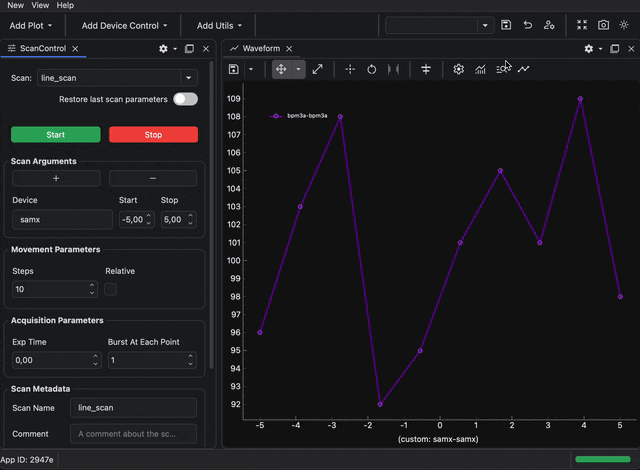
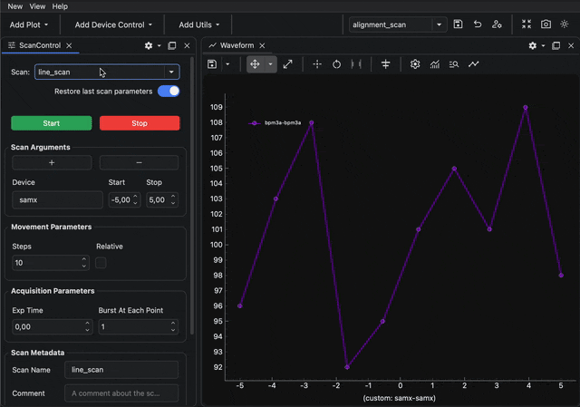
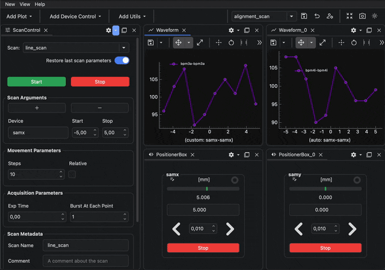
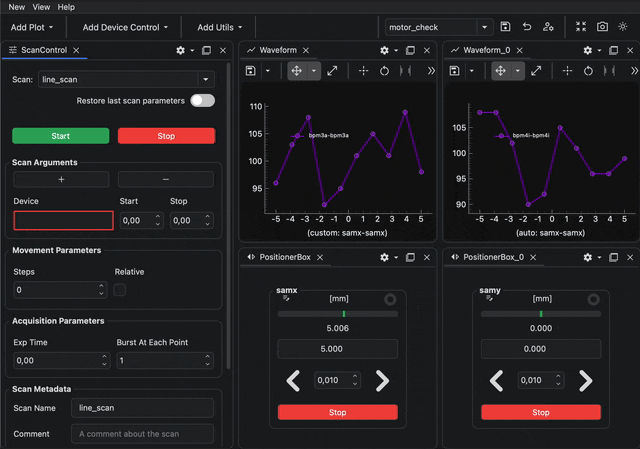

---
related:
  - title: Switch GUI profiles
    url: how-to/gui/switch-gui-profile.md
  - title: Toggle GUI profile quick selection
    url: how-to/gui/toggle-gui-profile-quick-selection.md
  - title: Restore a GUI profile to its default
    url: how-to/gui/restore-gui-profile-default.md
  - title: Delete a GUI profile
    url: how-to/gui/delete-gui-profile.md
  - title: Share a GUI profile with other accounts
    url: how-to/gui/share-gui-profile-with-other-accounts.md
  - title: Learn how GUI profiles work
    url: learn/gui/gui-profiles.md
  - title: Script GUI behaviour
    url: how-to/gui/script-gui-behaviour.md
---

# Save and Switch GUI Profiles

!!! info "Goal"

    In this tutorial you will save two dock area reusable configurations as GUI profiles and switch between them.

This tutorial continues from [06 Create Your First GUI](../quick-start/06-create-your-first-gui.md){ data-preview }.
Start with BEC open in the `Terminal + Dock` interface and a dock area containing a scan control and a waveform plot.

## 1. Save the current layout

In the dock area toolbar, click the save button.

Enter the profile name:

```
alignment_scan
```

Keep `Include in quick selection` enabled, then click `Save`.



The profile name appears in the profile selector in the dock area toolbar.

## 2. Change the layout and add more widgets

Create a second layout that is easy to recognize when you switch profiles:

1. Open `Add Device Control` and add twice `PositionerBox`.
2. Open `Add Plot` and add another `Waveform`.
3. Move the new widgets to the right side of the dock area.

You should now have the original scan control and waveform plot, plus two positioner boxes and
a second waveform plot.



## 3. Save a second profile

Click the save button again.

Enter the profile name:

```
motor_check
```

Keep `Include in quick selection` enabled, then click `Save`.



## 4. Switch between profiles

Use the profile selector in the dock area toolbar to switch back to `alignment_scan`.

The dock area reloads the layout saved in the first profile. Use the selector again to switch to `motor_check`.



!!! success "What you have learned"

    You have saved two GUI profiles and used the dock area toolbar to switch between different layouts.

## Next step

To automate a profile-based GUI workflow, use
[Script GUI Behaviour](../../how-to/gui/script-gui-behaviour.md){ data-preview }.

To remove a local profile, use [Delete a GUI Profile](../../how-to/gui/delete-gui-profile.md).
For a background on profile inspection, storage, and sharing, see
[GUI Profiles](../../learn/gui/gui-profiles.md).
