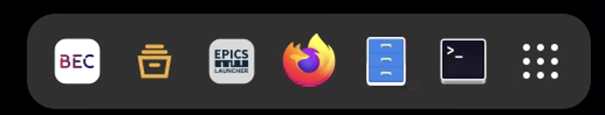
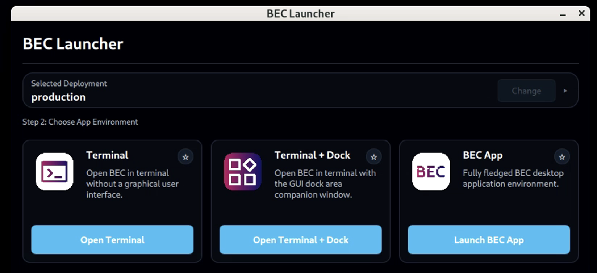
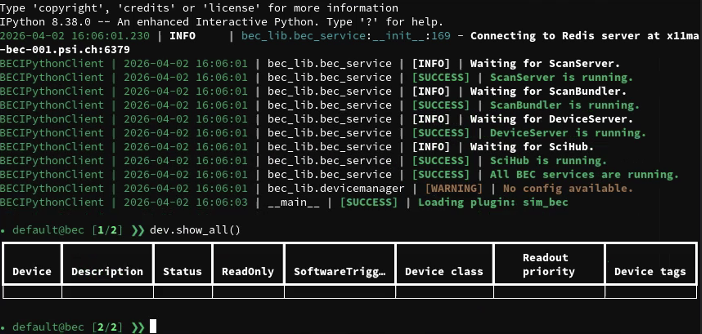

!!! info "Goal"

    In this tutorial you will start BEC either from a PSI-managed console or from a local environment. By the end, you
    will have a running BEC IPython client and know how to recognize that the session is ready for the rest of the Quick Start sequence.

/// tab | :material-office-building: PSI-managed Beamline Console

### 1. Open the BEC Launcher

Use a beamline console. You should see a BEC icon in the dock that opens the BEC Launcher where you can choose the
deployment and application mode. Start BEC by clicking the BEC icon on the beamline console.



If you do not see the icon, ask your local support team to set up BEC for you.

### 2. Start the BEC terminal



The launcher offers three application modes. To keep the first steps simple, choose `Terminal`. This opens the `BECIPythonClient` in a terminal, which will be used to learn the basic BEC tools in the following tutorial pages.
<!-- TODO: link to different application modes. -->
<!-- TODO: link to information about deployments. -->

///
/// tab | :material-laptop: Local environment outside PSI

### 1. Activate your local BEC environment
Open a new terminal, and activate your local BEC Python environment.

```bash
source ./bec_venv/bin/activate  # or the command that matches your environment
```

!!! warning "Local setup pre-requisites"

    Please make sure that you have a local BEC environment set up and installed. If you have not done this yet, follow the instructions in [Install BEC locally](../../how-to/general/install-bec-locally.md) first.

    Also, make sure that your BEC server and Redis are running, as the client will not be able to work properly without them.

### 2. Start the client
Now you can start the BEC client without the GUI using the `bec` command:

```bash
bec --nogui
```

///

## 3. Recognize a successful startup

After the terminal opens, wait for the session to be ready. After some diagnostic output, the prompt changes to the BEC prompt and shows your user, the session name, the current command number, and the next scan number.

!!! tip "BECIPython Client prompt"

    The prompt is based on IPython. A prompt such as `default@bec [4/19]` means you are in the `default` session, you are currently on command
    number `4`, and the next scan submitted in that session will receive scan number `19`.

Try the following in the shell:

```python
dev.show_all()
```

This may show an empty list, in a fresh environment, or it may show the devices already loaded if you are at a beamline.
In the next session, you will learn how to load a configuration.




## 4. Keep this session open

Leave the BEC terminal running - the remaining Quick Start tutorials continue in this same client session.

!!! success "What you have learned"

    You started BEC through the path that matches your environment, either from the PSI launcher or in a local
    environment on a non-PSI managed machine. You also confirmed that the main session objects are ready for the rest of
    the Quick Start sequence.

## Next step

Continue with [02 Load your first config](02-load-your-first-config.md).
