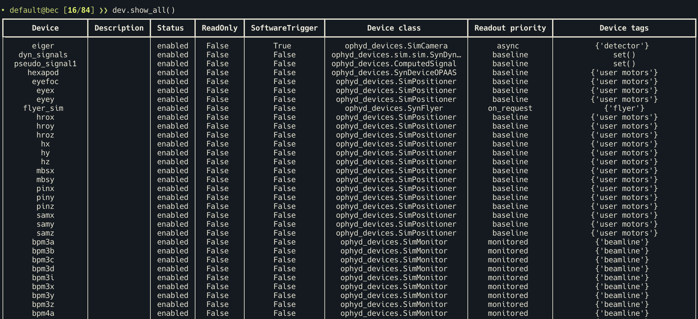
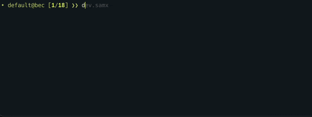

---
related:
  - title: Load and export a config
    url: getting-started/next-steps/load-and-export-a-config.md
---

# Load your first config

A "config" in BEC usually refers to a [device configuration](../../learn/devices/device-config-in-bec.md){ data-preview },
which specifies all the devices with which BEC can communicate and use in scans.

!!! Info "Goal"

    In this tutorial you will load the demo device configuration and use it to explore the first devices in your BEC
    session. By the end, you will have a live `dev` namespace with simulated devices and know the two fastest ways to
    inspect a device from the shell.

## Before you start

Continue with the same BEC session you opened in [01 Open BEC](01-open-bec.md).

## 1. Load the demo configuration

We will load a config with simulated devices, including motors and detectors. This mimics a beamline environment for the
purposes of learning and testing.

Load that demo configuration now:

--[]->[]--test_snippet--test_quickstart.py:test_load_demo_config:Load the demo config

## 2. Check the available devices

Inspect the devices currently available in the session:

--[]->[]--test_snippet--test_quickstart.py:test_show_all_devices:Show all the loaded devices

The output is a table of the devices currently available in your session, including whether they are enabled and how
BEC classifies them. In the demo configuration.

!!! tip "Tab completion"

    BEC provides tab completion throughout the shell. Try `dev.` and press `TAB` to discover available devices and attributes, or `scans.` to explore the scan interface.
    

## 3. Inspect one device

Start with one of the simulated motors:

--[]->[]--test_snippet--test_quickstart.py:test_inspect_samx:Inspect the samx motor

This prints a device overview with the most important metadata, current values, and config signals. Use this overview
when you want to understand what a device is, whether it is enabled, what limits it has, and so on.

## 4. Inspect the live values directly

--[]->[]--test_snippet--test_quickstart.py:test_samx_read:read from the samx motor

`.read()` returns the current state of the device and is the quickest way to inspect it from the shell.

!!! tip "Use `wm` for one or more devices"

    The `wm` command is convenient when you want a compact position overview. You can use it for a single device such as
    `wm(dev.samx)` or for multiple devices at once, for example `wm(dev.samx, dev.samy)`.

!!! success "What you have learned"

    You loaded the demo configuration, saw that BEC includes a simulated beamline for training and development, inspected
    the available devices, and learned the two most useful shell entry points for a first inspection: `dev.____` for the
    device overview and `dev.____.read()` for live values. In the next step you will start moving a device and learn the
    difference between blocking and non-blocking motion commands.

## Next step

Continue with [03 Move a device](03-move-a-device.md), where you will use the newly loaded motors for your first
controlled move.
