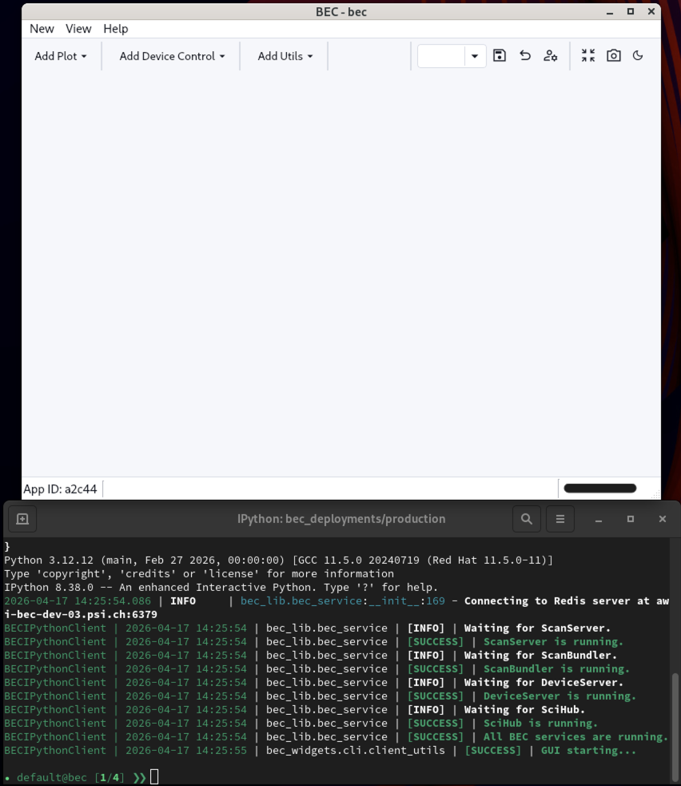
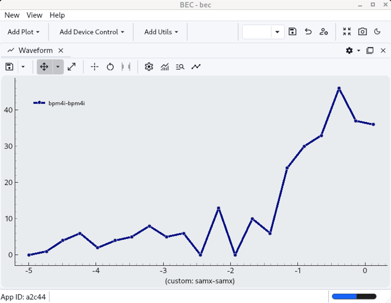

# Plot your first waveform

!!! Info "Goal"

    In this tutorial you will learn how to create a waveform widget from the BEC CLI, configure it to plot `bpm4i` vs `samx`, and observe live data while running a scan from the CLI. 

## Before you start

We will use the BEC launcher to start the BEC Ipython together with a Dock Area window. Please choose `Terminal + Dock` 
from the BEC launcher  [01 Open BEC](01-open-bec.md){ data-preview }.

You should now have a BEC IPython session running, and a dock area window open.



!!! Note

    For the following we assume that you have a config loaded in your BEC session that contains the `samx` and `bpm4i` devices. This is covered in the [02 Load Your First Config](02-load-your-first-config.md){ data-preview } tutorial.
    
## 1. Inspect the startup GUI objects

The BEC startup gives you a `gui` object. The default dock area opened by `Terminal + Dock` is available as `gui.bec`.

```python
gui.bec
```

## 2. Available widgets

The `gui` object has an `available_widgets` attribute that lists all the widget types you can create from the CLI. 
This will print a table of widget classes available programmatically, including the waveform widget we will use in this tutorial.

--[]->[]--test_snippet--test_quickstart.py:test_available_widgets:Show available widgets 


## 3. Add a waveform widget

Create a new `Waveform` directly in the existing `bec` dock area, and assign it to the variable `wf`:

```python
wf = gui.bec.new(gui.available_widgets.Waveform)
```

!!! Note

    By assigning the created widget to a variable, you can access it directly from there. 
    However, you can also access it through the dock area widget tree, in the example above this would be 
    ``` python
    gui.bec.Waveform
    ``` 
    since this is the first `Waveform` created in that dock area.

## 4. Configure the waveform

We will now configure the waveform to plot `bpm4i` against `samx`.

```python
wf.plot(device_x=dev.samx, device_y=dev.bpm4i)
```

!!! Note

    If you have run scans before, you might already see a curve in the waveform after running the above command. This is because the waveform by default tries to plot historical data if it is available. 

## 5. Run a scan

Now we run a line scan in the CLI and watch the waveform update live with incoming points.

```python
scans.line_scan(dev.samx, -5, 5, steps=10, exp_time=0.1, relative=False)
```



!!! success "What you have learned"

    You used the startup `gui` object to create a waveform widget from the CLI, and plotted live scan data during a scan.


## Next step

Continue with [06 Create Your First GUI](06-create-your-first-gui.md){ data-preview } if you would like to learn how to use the BEC GUI to create the same workflow with drag-and-drop widgets and no programming.
