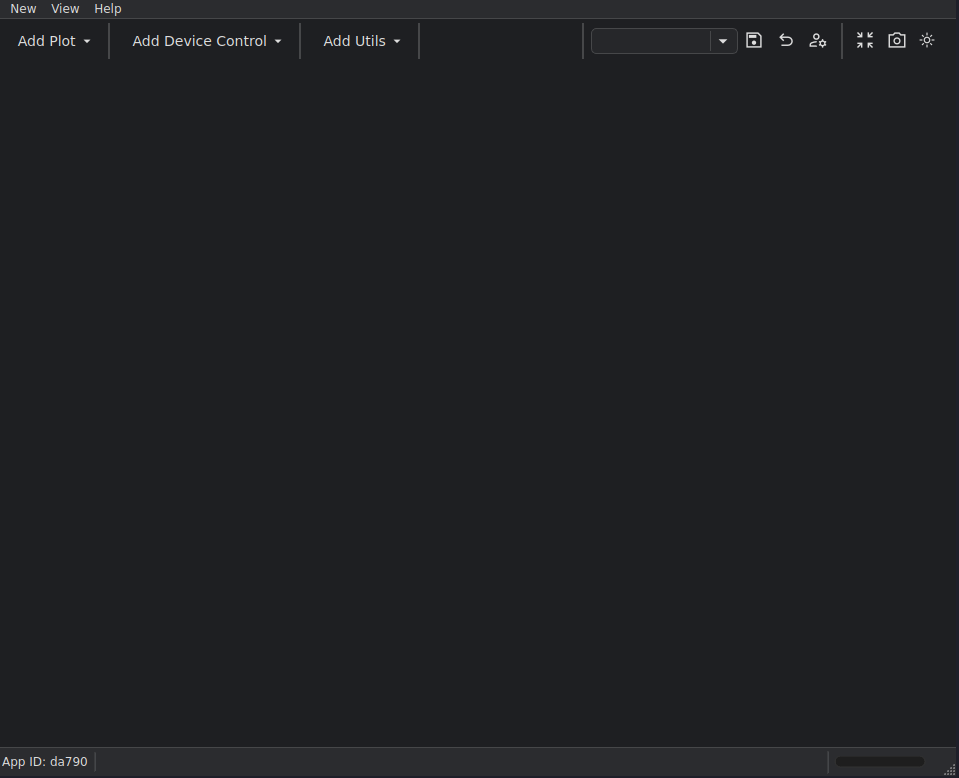
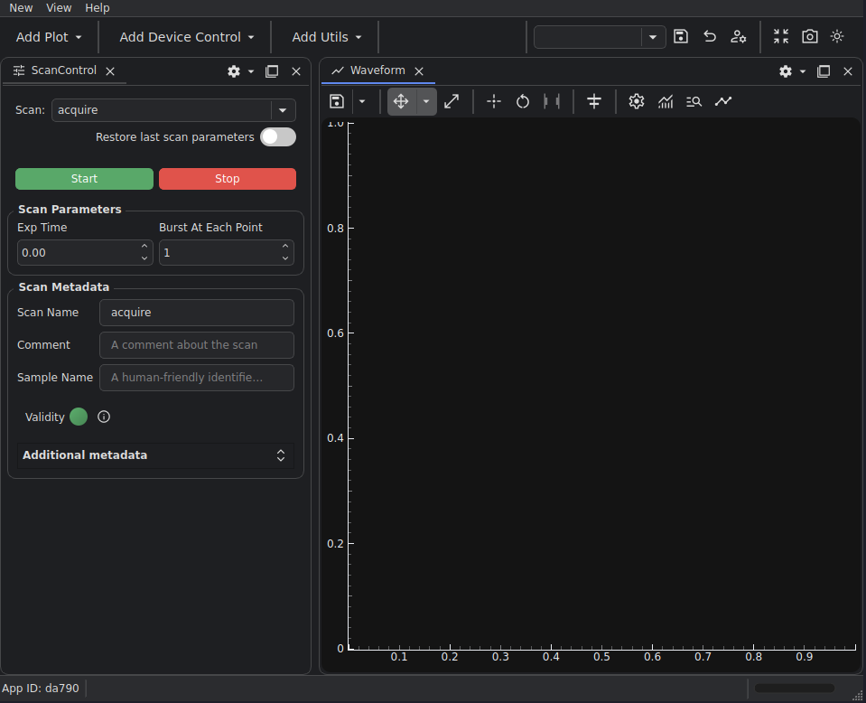
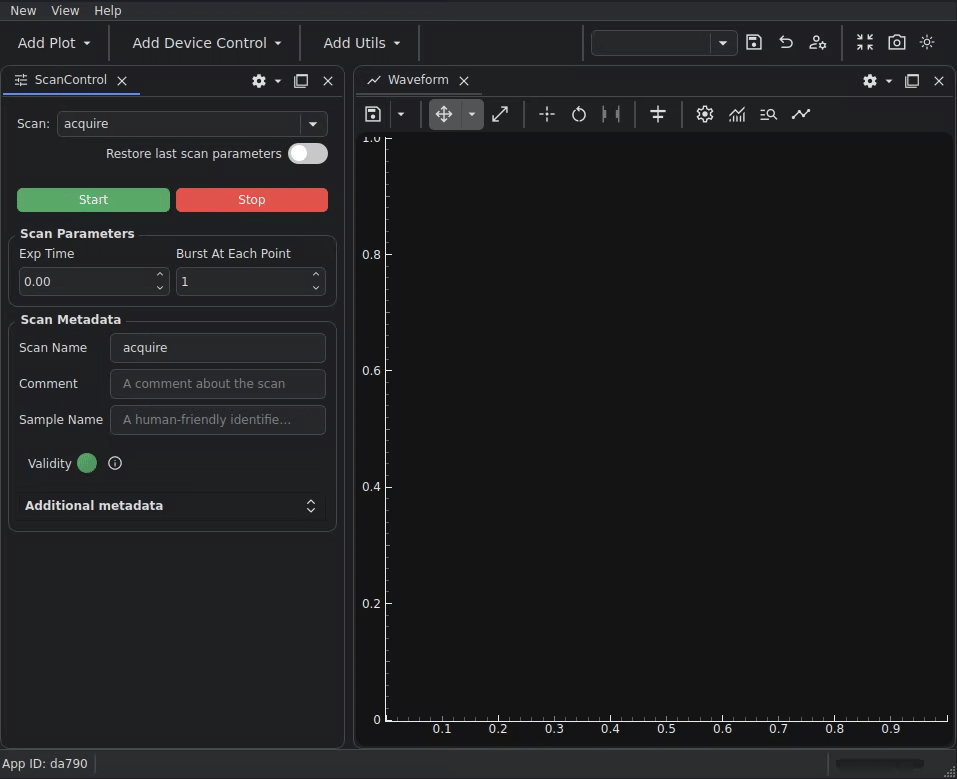
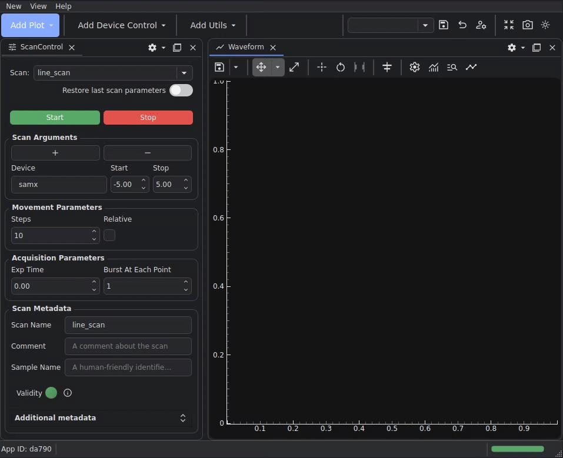
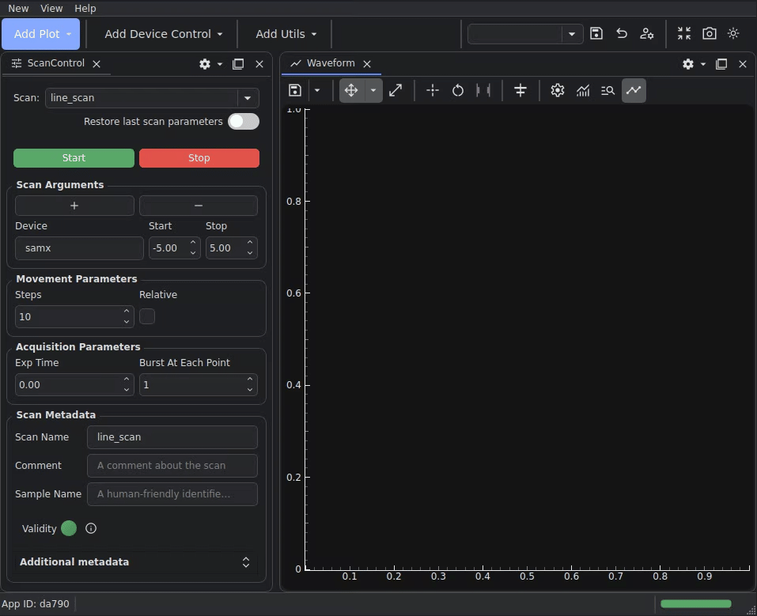

# Create Your First Plot

!!! info "Goal"

    In this tutorial you will learn how to plot data collected in a BEC scan.

## 1. Getting started - open BEC with a GUI interface

In the BEC launcher (see [01 Open BEC](01-open-bec.md){ data-preview }), select the `Terminal + Dock` interface.


You should be greeted by the same terminal interface from the previous tutorials, and an additional dock area GUI window:



## 2. Add some widgets

From the `Add Device Control` menu, select `add scan control`. Then, from the `Add Plot` menu, select `add waveform`. This should add the two widgets to your dock area.



## 3. Set up your widgets

Fill in similar scan parameters to the scan control widget:

```
Device: samx
Start: -5
Stop: 5
Steos: 10
```



Select the devices to display on the plot by clicking on the curve dialog button, changing the X-axis mode to `device`, and entering `samx`. Then for the Y-axis, add a new curve with the `+` button, and enter `bpm3a` in the name field. Close the dialog by clicking the `OK` button.



## 4. Run a scan and see the plot

Click on the green `Start` button in the scan control widget to run the scan and see the plot appear on the waveform widget.



!!! success "What you have learned"

    You have run a scan, the data from which was automatically plotted.

## Next step

You can take a look at the tutorials in the "Next Steps" category, or if you have a specific task in mind, you might find some help in the [how-to](../../how-to/index.md) section.
