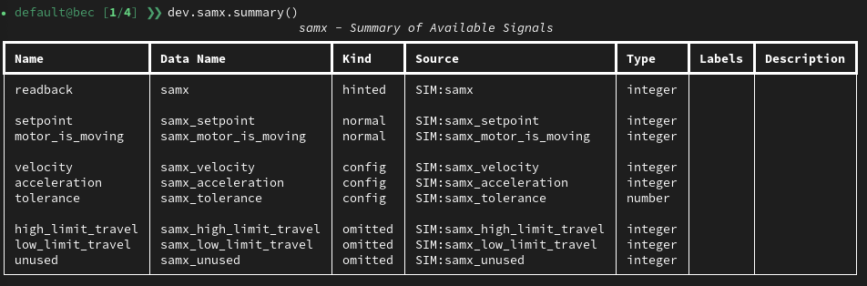

---
related:
  - title: Inspect a Device from the BEC IPython Client
    url: how-to/devices/inspect-a-device-from-the-bec-ipython-client.md
  - title: Device Configuration in BEC
    url: learn/devices/device-config-in-bec.md
  - title: ophyd Kind in BEC
    url: learn/devices/ophyd-kinds.md
  - title: Use simulated models from the IPython client
    url: how-to/gui/use-simulated-models-from-ipython.md
---

# Change Config Signals from the BEC IPython Client

!!! Info "Overview"
    Change a signal-backed configuration value from the BEC IPython client and verify the new value on the device.

## Prerequisites

- You have a running BEC IPython client session.
- The target device is available in the session, for example `dev.samx`.
- The value you want to change is exposed as a config signal on the device.

## 1. Identify the config signal

Inspect the device signals first:

```py
dev.samx.summary()
```



This prints an overview of the device's available signals, including their kind. Use it to find which signals are marked as `config`.

!!! learn "[Learn more about device configuration](../../learn/devices/device-config-in-bec.md){ data-preview }"

!!! learn "Whether a signal is included in `.read()` or `.read_configuration()` depends on its ophyd `Kind`. [Learn more about ophyd Kind](../../learn/devices/ophyd-kinds.md){ data-preview }"

Then check the configuration-style signals explicitly:

--[]->[]--test_snippet--test_howto_devices.py:test_samx_read_configuration:Read configuration signals

Use this to confirm the exact signal name and the current value before changing it.

## 2. Change the value

Config signals are exposed as normal device attributes. Set the new value from the client and wait for completion:

```py
dev.samx.velocity.set(20).wait()
```

Use `set(...).wait()` when you want the shell command to block until the update has completed.

## 3. Verify the new value

Read the config signals again:

```py
dev.samx.read_configuration()
```

You can also inspect the signal directly:

```py
dev.samx.velocity.get()
```

## 4. Use device convenience properties when available

Some device settings are exposed through convenience properties on the device object itself. For example, motor limits can be changed like this:

```py
dev.samx.low_limit = -20
dev.samx.high_limit = 20
```

Or in one call:

```py
dev.samx.limits = [-20, 20]
```

!!! tip "Check whether something is a signal or a property"

    In IPython, evaluate the attribute directly and press `ENTER` if you are not sure whether it is a signal or a convenience property.

    --[]->[]--test_snippet--test_howto_devices.py:test_samx_signal_attribute:Signal

    A signal is shown as a signal object.

    --[]->[]--test_snippet--test_howto_devices.py:test_samx_property_attribute:Convenience property 

    A convenience property resolves immediately to its value.

!!! success "Congratulations!"

    You can now inspect config signals with `read_configuration()`, update them from the BEC IPython client, and verify the result immediately.

## Common Pitfalls

- Not every entry in `deviceConfig` is a signal-backed config signal. `read_configuration()` only shows values exposed through ophyd config signals.
- Prefer `set(...).wait()` over a bare `set(...)` if you need confirmation that the update finished before the next command runs.
- Changing a runtime config signal is not the same as editing the source YAML file. If you need the change to be part of your long-term beamline configuration, also save or update the device config file.

## Next Steps

- Use [Inspect a Device from the BEC IPython Client](inspect-a-device-from-the-bec-ipython-client.md) when you need a broader device overview before making changes.
