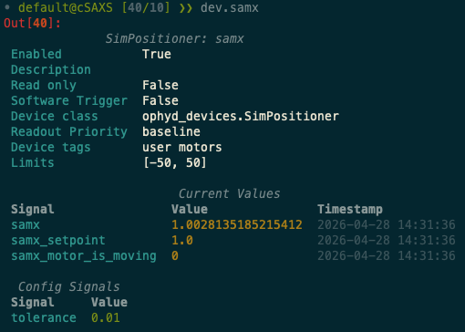

---
related:
  - title: Device Configuration in BEC
    url: learn/devices/device-config-in-bec.md
  - title: Load and Save a Device Session
    url: how-to/devices/load-and-save-a-device-session-from-the-bec-ipython-client.md
  - title: Select a Readout Priority
    url: how-to/devices/how-to-select-readout-priority.md
  - title: Inspect a Device from the BEC IPython Client
    url: how-to/devices/inspect-a-device-from-the-bec-ipython-client.md
---

# Inspect the Current Device Session

!!! Info "Overview"
    Inspect the current BEC device session from the IPython client so you can see which devices are active right now.

## Prerequisites

- You have a running BEC IPython client session.
- A device configuration is already loaded into BEC.

## 1. Show all devices in the current session

To display the current session from the client, run:

```py
dev.show_all()
```

The `dev` object is the device container exposed by the client, and `show_all()` prints a table of the devices currently known in the session.


The table includes fields about the device configuration as currently active in the session. An important subset of these fields are:

- `Status`: whether the device is currently enabled in the active session
- `Device class`: the ophyd class BEC uses to construct the device
- `Readout priority`: how BEC treats the device during scans

!!! learn "[Learn more about device configuration fields](../../learn/devices/device-config-in-bec.md){ data-preview }"

!!! learn "[Learn more about readout priority and how it affects scan behavior](../../learn/devices/readout-priority.md){ data-preview }"

## 2. Use the output to confirm the active session

Use `dev.show_all()` when you want to check:

- whether a newly loaded configuration is active
- whether a device is enabled or disabled in the current session
- which device class or readout priority a device currently has
- which device names are available from the client

## 3. Runtime changes to the session

Some session values can be changed at runtime from the client.

For example, you can disable the simulated `samx` motor in the current session:

```py
dev.samx.enabled = False
```

If you run `dev.show_all()` again afterwards, `samx` will appear as disabled.

Use this carefully: changing runtime device settings is not only a display change. Fields such as `enabled` and `readoutPriority` affect how BEC handles the device and its readings in the current session.

If you only want to inspect the session, avoid changing values unintentionally.

!!! tip "Before changing the config in runtime"

    - Read [Device Configuration in BEC](../../learn/devices/device-config-in-bec.md) to understand what these fields mean.
    - Read [Select a Readout Priority](how-to-select-readout-priority.md) to understand the impact of readout priority.

## 4. Continue to a device-level inspection when needed

You may also inspect a specific device in more detail from the client. 

```py
dev.samx
```

This will show you the current runtime configuration of the `samx` device, including the last values for signals from `read` and `read_configuration`.


```

!!! success "Congratulations!"

    You have succsessfully inspected the current device session.

## Common Pitfalls

- `dev.show_all()` shows the current session state exposed to the client. It is not a direct view of the original YAML file on disk.
- Changing values such as `enabled` or `readoutPriority` in runtime affects current BEC behavior. These changes do not automatically update the YAML file on disk, but they do affect how BEC handles the device in the current session.

## Next Steps

- Use [Inspect a Device from the BEC IPython Client](inspect-a-device-from-the-bec-ipython-client.md) for a deeper look at one device.
- Use [Load and Save a Device Session](load-and-save-a-device-session-from-the-bec-ipython-client.md) if you need to change which configuration is active.
