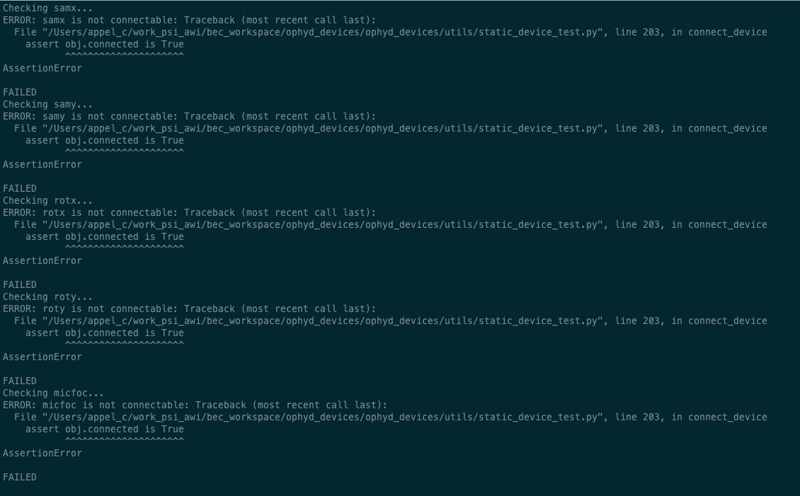

---
related:
  - title: Managing Device Configurations
    url: learn/devices/managing-device-configs.md
  - title: Device Configuration in BEC
    url: learn/devices/device-config-in-bec.md
  - title: Load and Save a Device Session
    url: how-to/devices/load-and-save-a-device-session-from-the-bec-ipython-client.md
---

# Validate a Device Configuration

!!! Info "Overview"
    Validate a device configuration file before loading it into BEC so you can catch schema and connection problems early.

## Prerequisites

- You have activated the BEC Python environment.
- You know the path to the YAML file you want to validate.
- If the connection should be tested, you can access the underlying devices from the machine where you run the validation.

## 1. Run a static validation

To validate the structure of a device configuration file, run:

```bash
ophyd_test --config ./path/to/my/config/file.yaml
```

This checks whether the configuration can be parsed and validated as a BEC device configuration.

## 2. Check whether devices can also connect

If you also want to test device creation and connection, add `--connect`:

```bash
ophyd_test --config ./path/to/my/config/file.yaml --connect
```

Use this when the target environment has access to the underlying devices and you want to catch connection issues before loading the config into a running session.

## 3. Load the file after validation

Once the file validates successfully, load it from the BEC IPython client:

```py
bec.config.update_session_with_file("./path/to/my/config/file.yaml")
```

!!! success "Congratulations!"

    You can now validate a device configuration with `ophyd_test` before loading it to BEC.


!!! info "Validation was not successful"

    If you encounter validation errors, they are printed in the terminal with details about the problem. In addition, the tests writes a report to `./device_test_reports/<file_name>.txt` in the current working directory. This file includes an overview of the encountered errors during the test run, and is helpful to identify and fix problems in the configuration file.

    

## Common Pitfalls

- A static validation does not prove that all devices are reachable. Use `--connect` when you also need a connection check.
- A successful validation does not replace reviewing the resulting session. After loading the file, inspect the session in the client as well.
- Connection checks depend on the current environment. A file may validate on one machine but fail to connect on another.

## Next Steps

- Continue with [Load and Save a Device Session](load-and-save-a-device-session-from-the-bec-ipython-client.md) to apply the file.
