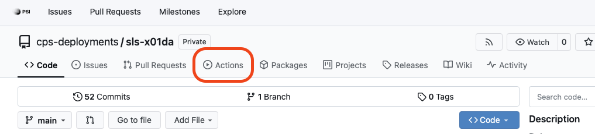
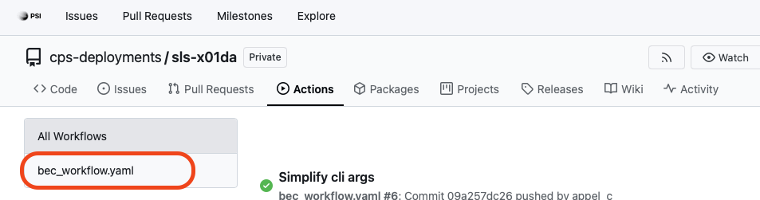
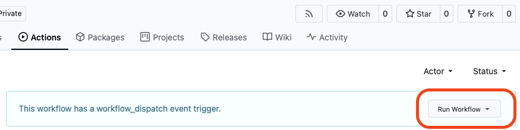
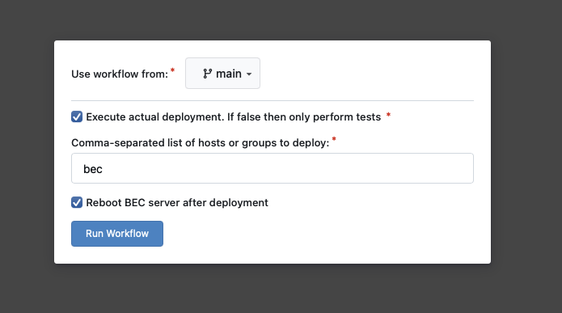

---
related:
  - title: Add changes to your plugin repository
    url: how-to/git/add-changes-to-plugin-repository.html
---

# Update BEC to the Latest Version

!!! Info "Overview"
    This is a how-to guide on updating BEC to the latest version. This will re-install BEC and all its dependencies in a fresh environment.
    
    Please note that this is a PSI-specific guide and will not be applicable to other installations of BEC. For other installations, please refer to the installation guide.

## Pre-requisites
- You are a beamline scientist or are responsible for maintaining BEC at the beamline.
- You are within the PSI intranet.

!!! Warning "Important"
    Before updating BEC, please make sure that no data acquisition is currently running in BEC as the update process will require restarting BEC and all its services.

## Updating BEC
The update process is built around Gitea pipelines. In the following example, we will show you the steps for x01da / Debye but the process is the same for all beamlines.

1. Go to the Gitea repository for your CPS deployments: https://gitea.psi.ch/cps-deployments
1. Find the your beamline's deployment repository. For x01da, it is https://gitea.psi.ch/cps-deployments/sls-x01da
1. Click on the "Actions" tab.

    <figure markdown="span" style="padding: 0.75rem 0;">
      {width="80%"}
    </figure>

1. On the left side, select the `bec_workflow.yaml` workflow.

    <figure markdown="span" style="padding: 0.75rem 0;">
      {width="80%"}
    </figure>

1. On the right side, click on the "Run workflow" button.

    <figure markdown="span" style="padding: 0.75rem 0;">
      {width="80%"}
    </figure>

1. In the workflow dialog, select the hosts you want to update BEC on.

    <figure markdown="span" style="padding: 0.75rem 0;">
      {width="80%"}
    </figure>

    !!! Note "Host selection"
        **Option 1**: Update all hosts: You can simply update all hosts by using "bec" as host.  
        **Option 2**: Update only a specific host: If you only want to update a specific host, specify the full hostname, e.g. "x01da-bec-001.psi.ch".

1. Click on the "Run workflow" button to start the update process.

1. You can monitor the progress of the workflow in the "Actions" tab. Click on the currently running workflow to see the logs. The process will take around 5 to 10 minutes.

!!! success "Congratulations!"
    You have successfully updated BEC to the latest version.

## Common pitfalls
- If the workflow fails and cannot find the hostname, it is likely that there was a typo in the hostname or the ".psi.ch" part was missing. Make sure to specify the full hostname, e.g. "x01da-bec-001.psi.ch".
