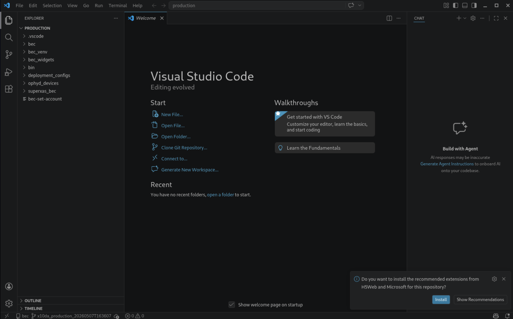
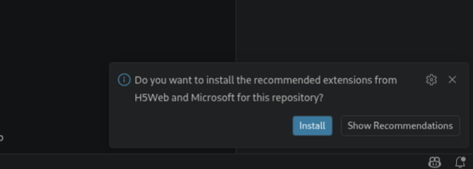

---
related:
  - title: Add Changes to Your Plugin
    url: how-to/git/add-changes-to-plugin-repository.html
  - title: Install BEC Locally
    url: how-to/general/install-bec-locally.html
---

# Work with VS Code

!!! Info "Overview"
    This is a how-to guide on using VS Code for working with your BEC plugin.

## Prerequisites

- You have write access to your beamline plugin directory, for example `/sls/<xname>/config/bec/production/<plugin_name>`.
- If you don't have write access, you can still use VS Code to create and edit files outside of the deployment but you cannot modify the plugin repository directly.

## Open VS Code in the correct folder

Opening the correct folder is important for VS Code to work well. We highly recommend opening the deployment directory:

/// tab | Template
```bash
cd /sls/<xname>/config/bec/<deployment_name>
code .
```
///

/// tab | Example
```bash
cd /sls/x01da/config/bec/production
code .
```
///

This ensures that VS Code finds the already prepared settings.json file with the correct Python environment.

<figure markdown="span" style="padding: 0.75rem 0;">
  {width="90%"}
</figure>

## Install recommended extensions

When you open the deployment folder, VS Code will prompt you to install recommended extensions. We recommend installing them.

<figure markdown="span" style="padding: 0.75rem 0;">
  {width="90%"}
</figure>


This will give you access to Python language support, formatters, linters but also H5Web for previewing HDF5 files.


## Common Pitfalls

- If Python syntax highlighting and auto-completion are not working, check that you have the Python extension installed and that the correct directory is open.
- If you cannot edit files in the deployment, check that you have write access to the deployment directory. Experiment accounts usually do not have write access to the production deployment, so you may need to log in with your personal account.

## Next Steps

- Continue with [Add Changes to Your Plugin](../git/add-changes-to-plugin-repository.md) if you
  want to commit and push your changes.

!!! success "Congratulations!"
    You have successfully set up VS Code for working with your BEC plugin.
