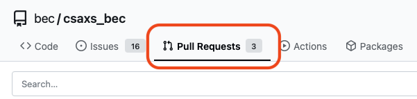
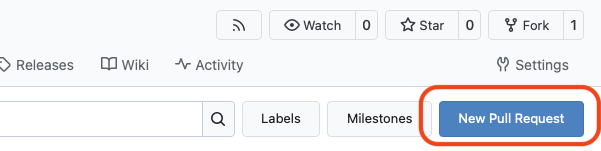
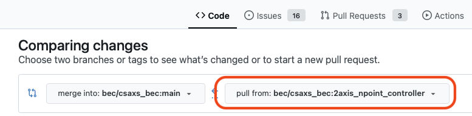
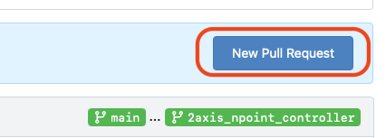
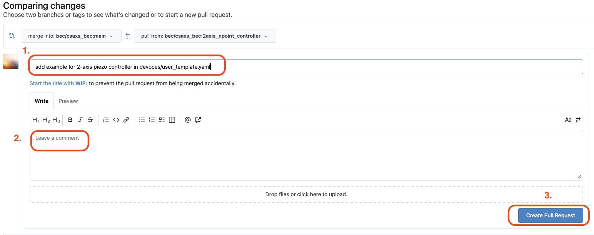
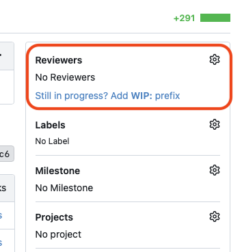
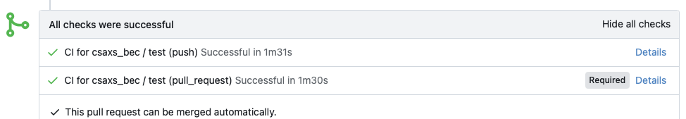
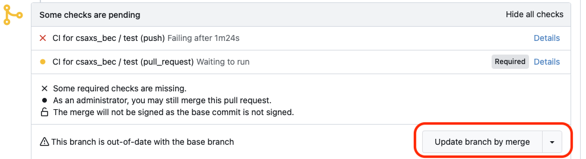
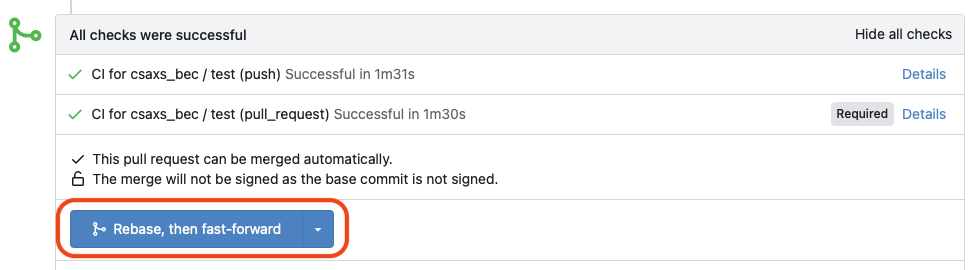

---
related:
  - title: Add Changes to Your Plugin Repository
    url: how-to/git/add-changes-to-plugin-repository.html
  - title: Update BEC to the latest version
    url: how-to/general/update-deployment.html
---

# Merge Changes to `main`

!!! Info "Overview"
    This is a how-to guide on merging your changes into the `main` branch of your plugin repository.

    Use this after you have committed and pushed your changes to a branch and you want to make them part of the main line of development.

## Prerequisites
- You have already pushed your changes to the remote repository.
- You can access your repository in Gitea.
- Your branch is ready to be reviewed and merged.

## Steps to merge your changes
1. Open your repository in Gitea, for example:

    ```text
    https://gitea.psi.ch/bec/<plugin_name>
    ```

1. Open the **Pull Requests** tab.

    <figure markdown="span" style="padding: 0.75rem 0;">
      {width="90%"}
    </figure>

1. On the right, click on the **New Pull Request** button.

    <figure markdown="span" style="padding: 0.75rem 0;">
      {width="90%"}
    </figure>

    This will open the pull request creation page, where you can select the base and compare branches.


1. Select the base branch (left) as `main` and the compare branch as your feature branch (right).

    <figure markdown="span" style="padding: 0.75rem 0;">
      {width="90%"}
    </figure>

1. On the right, click the **New Pull Request** button to create the pull request.

    <figure markdown="span" style="padding: 0.75rem 0;">
      {width="90%"}
    </figure>

1. Add a title and description for your pull request, then click **Create Pull Request** again.

    <figure markdown="span" style="padding: 0.75rem 0;">
      {width="100%"}
    </figure>

1. Request a review from your team members.
    It is always good practice to have at least one other person review your changes before merging.
    Gitea allows you to request specific reviewers on the pull request page by adding them in the "Reviewers" section.
    You can also add someone from the BEC team as a reviewer if you want feedback.

    <figure markdown="span" style="padding: 0.75rem 0;">
      {width="90%"}
    </figure>

1. Review your changes carefully.

1. Make sure all checks pass.

    <figure markdown="span" style="padding: 0.75rem 0;">
      {width="90%"}
    </figure>

    If any checks fail, fix the issues in your branch and push the changes again. The pull request will update automatically. If you need help understanding or fixing failed checks, ask for help from your team or the BEC team.

1. If your branch is not up to date with `main`, you may need to update it before merging. You can do this by merging `main` into your branch or rebasing your branch onto `main`. After updating, push the changes to the remote repository. Gitea offers a button to update the branch if it is behind `main`.

    <figure markdown="span" style="padding: 0.75rem 0;">
      {width="90%"}
    </figure>

1. Merge the pull request into `main`.

    <figure markdown="span" style="padding: 0.75rem 0;">
      {width="90%"}
    </figure>

    After the merge, Gitea may offer to delete the feature branch. This is usually fine if you no longer need it.


## Common Pitfalls
- If the pull request shows unexpected files, go back to your branch and check `git status` and `git diff`.
- If Gitea reports merge conflicts, update your branch with the latest `main`, resolve the conflicts locally, and push again.
- If the base branch is not `main`, double-check the target before merging.

## Next Steps
- Continue with [Update BEC to the latest version](../general/update-deployment.md) to deploy the merged changes.

!!! Success "Congratulations!"
    You have successfully merged your changes into `main`. You can now deploy the updated repository to your BEC instance.
