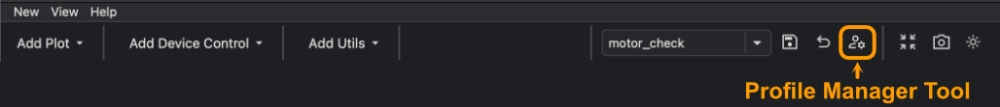
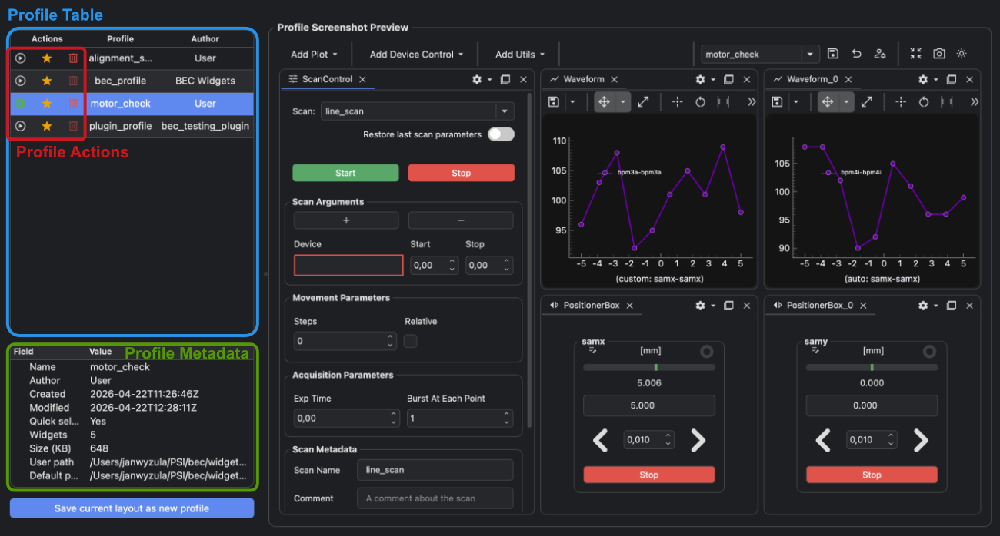

---
related:
  - title: Switch GUI profiles
    url: how-to/gui/switch-gui-profile.md
  - title: Restore a GUI profile to its default
    url: how-to/gui/restore-gui-profile-default.md
  - title: Share a GUI profile with other accounts
    url: how-to/gui/share-gui-profile-with-other-accounts.md
  - title: Learn about profile origins and metadata
    url: learn/gui/gui-profile-copies-and-namespaces.md#profile-origins
---

# Delete a GUI Profile

!!! Info "Goal"

    Delete a locally created GUI profile from the dock area profile manager.

## Prerequisites

- You have BEC open with a dock area.
- The profile you want to delete was created locally.

If you do not have profiles yet, first create one with
[Save and Switch GUI Profiles](../../getting-started/next-steps/save-and-switch-gui-profiles.md){ data-preview }.

Read-only profiles from BEC Widgets or the beamline plugin repository cannot be deleted from the GUI.

## 1. Open the profile manager

Click the manage button :material-account-cog: in the dock area toolbar.



## 2. Select the profile

Click the profile you want to delete.

Check the metadata panel before deleting. Profiles from the local settings area can be deleted; bundled read-only
profiles cannot.



!!! learn "[Learn more about the profile manager fields](../../learn/gui/profile-manager.md){ data-preview }"

!!! learn "[Learn about GUI profile origins](../../learn/gui/gui-profile-copies-and-namespaces.md#profile-origins){ data-preview }"

    The profile origin controls whether the profile can be deleted from the profile manager.

## 3. Delete the profile

Click the delete button <span style="color: red;">:material-trash-can-outline:</span>.

Confirm the deletion when prompted.

Deleting a profile removes the writable copy from the local settings area.

## 4. Delete from the BEC IPython client

You can delete a local profile from the `BECDockArea` object in the BEC IPython client:

```python
gui.bec.delete_profile("profile_name")
```

Replace `profile_name` with the name shown in the profile manager.

!!! success "Result"

    The local profile is removed from the profile manager and no longer appears in the toolbar selector.

## Common Pitfalls

- The delete button is disabled for read-only profiles.
- Deleting a local profile cannot be undone from the profile manager.
- To make a useful profile available to other accounts, share it through the plugin repository before deleting your
  local copy.
