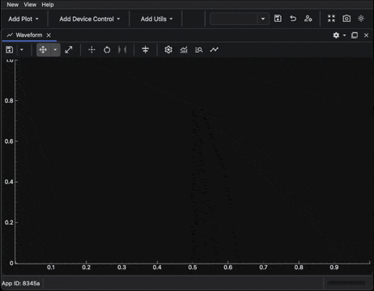

---
related:
  - title: Plotting and Data Analysis
    url: how-to/gui/ipython-client-gui.md
  - title: Control a Waveform from the IPython Client
    url: how-to/gui/control-waveform-from-ipython.md
  - title: Use simulated models from the IPython client
    url: how-to/devices/use-simulated-models-from-ipython.md
  - title: GUI RPC interface reference
    url: references/bec-widgets/gui-rpc-interface.md
---

# Fit Waveform Data with DAP

!!! info "Goal"

    Attach DAP model curves to Waveform data from the BEC IPython client and inspect the fit output.

Use this guide when a Waveform already has a source curve and you want BEC DAP to fit that curve. For basic Waveform
creation, plotting, and curve styling, start with
[Control a Waveform from the IPython Client](control-waveform-from-ipython.md){ data-preview }.

## Prerequisites

- BEC is running with a dock area.
- The `samx` and `bpm4i` devices are available in `dev`.
- A Waveform source curve exists, or you are ready to create one.

!!! note "Device names"

    In these examples, `samx` is a simulated positioner motor and `bpm4i` is a Beam Position Monitor.

## 1. Create a source curve

Create a Waveform and plot `bpm4i` against the `samx` motor position:

```python
wf = gui.bec.new(gui.available_widgets.Waveform)
wf.plot(device_x=dev.samx, device_y=dev.bpm4i)
```

Run a scan to produce data:

```python
scans.line_scan(dev.samx, -5, 5, steps=25, exp_time=0.1, relative=False)
```

The default source curve label is `bpm4i-bpm4i`, built from the y-axis device and signal.

## 2. Add a DAP curve to an existing curve

Attach a Gaussian DAP model to the existing `bpm4i-bpm4i` curve:

```python
wf.add_dap_curve(device_label="bpm4i-bpm4i", dap_name="GaussianModel")
```

`device_label` is the existing source curve to fit. `dap_name` is the DAP model to attach to that source curve.

## 3. Add DAP when creating the curve

If you know that the curve should have a DAP model from the start, add it in the initial `plot` call:

```python
wf.plot(device_x=dev.samx, device_y=dev.bpm4i, dap="GaussianModel")
```

Do not call `plot` again with the same device pair after the source curve already exists. That creates a duplicate
source curve and raises an error. Use `wf.add_dap_curve(...)` to add a DAP model to an existing curve.

## 4. Use multiple DAP models

`dap_name` can also be a list of model names when you want a composite model:

```python
wf.add_dap_curve(
    device_label="bpm4i-bpm4i",
    dap_name=["GaussianModel", "LinearModel"],
)
```

You can pass parameter overrides with `dap_parameters`. For composite models, pass either a list aligned with the model
list or a dictionary keyed by model name:

```python
wf.add_dap_curve(
    device_label="bpm4i-bpm4i",
    dap_name=["GaussianModel", "LinearModel"],
    dap_parameters={
        "GaussianModel": {
            "center": {"value": 0.0, "vary": True},
            "sigma": {"value": 1.0, "vary": False, "min": 0.0},
        }
    },
)
```

Use the same model names as the
[LMFit built-in models](https://lmfit.github.io/lmfit-py/builtin_models.html) classes, such as `GaussianModel`,
`LinearModel`, or `ConstantModel`.

## 5. Inspect DAP output

Inspect the DAP result summary:

```python
wf.get_dap_summary()
```

Inspect the fitted model parameters:

```python
wf.get_dap_params()
```

DAP curves are also Waveform curve items. You can retrieve and style them in the same way as other curves:

```python
fit_curve = wf.get_curve("bpm4i-bpm4i-GaussianModel")
fit_curve.set_color("orange")
fit_curve.set_pen_width(3)
```

## GUI equivalent

You can configure the same DAP setup from the Waveform curve settings dialog:

1. Open the Waveform curve settings dialog from the plot toolbar :material-chart-timeline-variant:.
2. Set the x-axis mode to `device`.
3. Set the x-axis device to `samx`.
4. Add a y-axis curve for `bpm4i`.
5. Add the `GaussianModel` DAP model to the curve.
6. Confirm the dialog and run the scan.



!!! success "Result"

    The Waveform shows the source curve and the fitted DAP model curve, and you can inspect the fitted parameters from
    the BEC IPython client.
