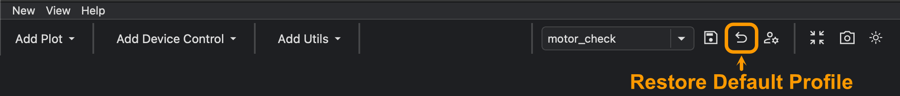
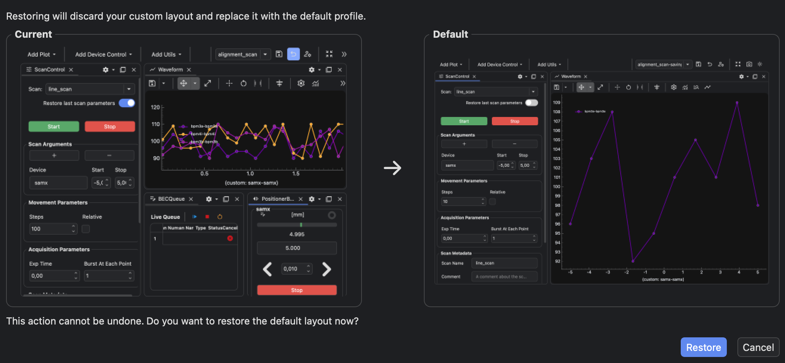

---
related:
  - title: Switch GUI profiles
    url: how-to/gui/switch-gui-profile.md
  - title: Toggle GUI profile quick selection
    url: how-to/gui/toggle-gui-profile-quick-selection.md
  - title: GUI Profile Copies and Namespaces
    url: learn/gui/gui-profile-copies-and-namespaces.md#user-and-default-copies
---

# Restore a GUI Profile to Its Default

!!! Info "Goal"

    Replace the current user copy of a GUI profile with its saved default layout.

## Prerequisites

- You have BEC open with a dock area.
- The profile you want to restore is the active profile.

If you do not have profiles yet, first create one with
[Save and Switch GUI Profiles](../../getting-started/next-steps/save-and-switch-gui-profiles.md){ data-preview }.

## 1. Activate the profile

Load the profile you want to restore.

Use [Switch GUI Profiles](switch-gui-profile.md) if you need to activate a different profile first.

## 2. Start the restore action

Click the reset button :material-arrow-u-left-top: in the dock area toolbar.

The dock area shows a confirmation dialog with previews of the current layout and the saved default layout.

## 3. Confirm the restore

Check the previews in the confirmation dialog.

Confirm the restore only if you want to replace the current user copy with the saved default snapshot.

When you confirm, BEC restores the user copy from the default copy and reloads the profile.

!!! learn "[Learn about default snapshots](../../learn/gui/gui-profile-copies-and-namespaces.md#user-and-default-copies){ data-preview }"

    The Learn page explains how BEC stores user and default copies, and why local profiles behave differently from
    bundled read-only profiles.

!!! success "Result"

    The dock area uses the saved default layout for the restored profile.

## Common Pitfalls

- Restoring a profile discards the current user copy for that profile.
- For locally created profiles, saving again with the same name and confirming the overwrite updates the saved default
  snapshot.
- Profiles from the beamline plugin repository and profiles bundled with BEC Widgets are read-only; their bundled
  defaults cannot be overwritten from the GUI.
