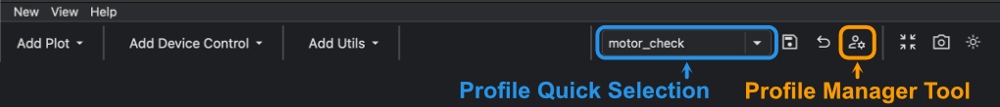

---
related:
  - title: Switch GUI profiles
    url: how-to/gui/switch-gui-profile.md
  - title: Delete a GUI profile
    url: how-to/gui/delete-gui-profile.md
  - title: Learn about quick selection and profile metadata
    url: learn/gui/profile-manager.md
---

# Toggle GUI Profile Quick Selection

!!! Info "Goal"

    Show or hide a GUI profile in the dock area toolbar selector without deleting the profile.

## Prerequisites

- You have BEC open with a dock area.
- The profile you want to change is already available.

If you do not have profiles yet, first create one with
[Save and Switch GUI Profiles](../../getting-started/next-steps/save-and-switch-gui-profiles.md){ data-preview }.

## 1. Open the profile manager

Click the **manage button** :material-account-cog: in the dock area toolbar.

## 2. Select the profile

Click the profile whose quick-select state you want to change.

Use the metadata panel to check the current quick-select state.

!!! learn "[Learn more about the profile manager fields](../../learn/gui/profile-manager.md){ data-preview }"

## 3. Toggle quick selection

Click the **toggle quick selection button** :material-star:.

If quick selection is enabled, the profile appears in the dock area toolbar selector. If quick selection is disabled,
the profile stays available in the profile manager but is hidden from the toolbar selector.

If you load a profile from the profile manager after disabling quick selection, the profile name can still appear in the
toolbar selector while that profile is active. After you switch to another profile, the disabled profile is removed from
the selector.

## 4. Check the toolbar selector

Close the profile manager or return to the dock area toolbar.

Open the **profile selector** and confirm that the profile is shown or hidden as expected.

!!! success "Result"

    The profile remains available in the profile manager, and its visibility in the toolbar selector matches the
    quick-select state you chose.

## Common Pitfalls

- Disabling quick selection does not delete the profile.
- A hidden profile can still be loaded from the profile manager or BEC IPython Client.

## Next Steps

- Use [Switch GUI Profiles](switch-gui-profile.md){ data-preview } to load a profile from the manager.
- Use [Delete a GUI Profile](delete-gui-profile.md){ data-preview } if you want to remove a local profile completely.
