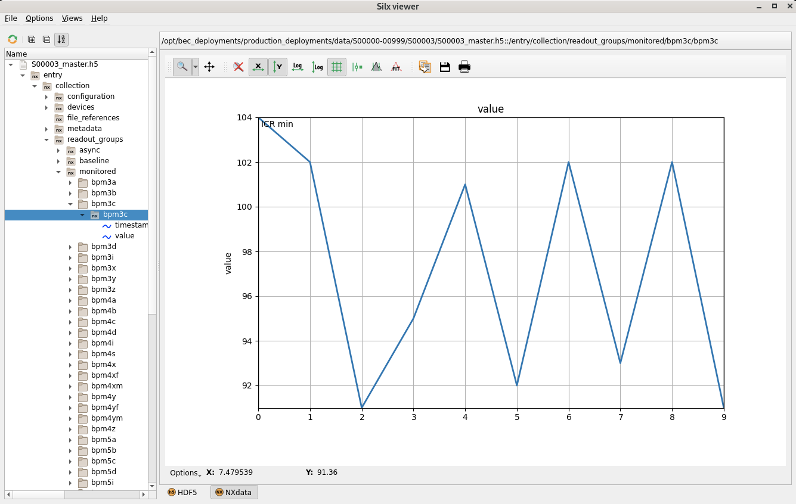

---
related:
  - title: Access Scan Data
    url: getting-started/next-steps/access-scan-data.md
  - title: Where Files Are Written
    url: learn/file-writer/where-files-are-written.md
  - title: Default HDF5 Layout
    url: learn/file-writer/default-format.md
---

# Open BEC HDF5 Files with silx

!!! info "Overview"
    Open a BEC scan file in `silx`, inspect its metadata and recorded signals, and locate linked detector files when present. `silx` is a graphical HDF5 viewer commonly available on all beamline consoles at PSI.

## Pre-requisites
- The file is readable from your current machine.
    
BEC usually writes one master file per scan, often named like `S01234_master.h5`. Start with that file rather than a detector file, because the master file contains the main BEC structure and can link to additional files.


## 1. Find the scan file

If you just ran the scan, copy the file path from the `File:` line in the scan report.

If you are looking up an older scan, use the scan history first:

```py
scan = bec.history[-1]
scan
```

Printing the scan container shows a summary that includes the file path.

## 2. Open the file in silx

From a terminal on the beamline console, start `silx` and open the file:

```bash
silx view /path/to/S01234_master.h5
```

If you prefer, you can also start `silx` first and then open the file from the graphical interface.

## 3. Inspect the main BEC groups

In the left-hand tree, expand the HDF5 structure under `/entry/collection`.

The groups that are usually most useful are:

- `metadata` for scan metadata such as scan number, scan ID, and user-defined metadata
- `readout_groups` for recorded scan data grouped by BEC readout priority
- `devices` for device-oriented entries
- `file_references` for links to external files created during the scan

Select a dataset to inspect its values. For numeric datasets, `silx` can also display plots or tables depending on the dataset shape.

<figure markdown="span" style="padding: 0.75rem 0;">
  {width="100%"}
  <figcaption>`silx` browsing a BEC master file and plotting a dataset from `readout_groups`.</figcaption>
</figure>

## 4. Check monitored and baseline data

For most scan inspection tasks, start in:

- `/entry/collection/readout_groups/monitored`
- `/entry/collection/readout_groups/baseline`

`monitored` typically contains the point-by-point scan data, while `baseline` contains values recorded once per scan or at low frequency.

## 5. Follow linked detector files when needed

If the scan includes detectors that write their own files, check `/entry/collection/file_references`.

The master file is still the best starting point, but the detector data itself can live in separate HDF5 files. Use the file references to see which external files belong to the scan, then open those files in `silx` as needed.

!!! success "Congratulations!"
    You have successfully opened a BEC scan file in `silx` and located the main metadata and data groups.

## Common pitfalls

- Opening a detector sidecar file first and expecting the full BEC scan structure there.
- Looking only under one custom beamline NeXuS group and missing the standard BEC content under `/entry/collection`.
- Opening a file before writing has finished and assuming missing datasets indicate a failed scan.
- Trying to open a file from a path that is not mounted or readable on the current console.

## Next steps

- [Access BEC History](access-bec-history.md){ data-preview }
- [Where Files Are Written](../../learn/file-writer/where-files-are-written.md){ data-preview }
- [Default HDF5 Layout](../../learn/file-writer/default-format.md){ data-preview }
