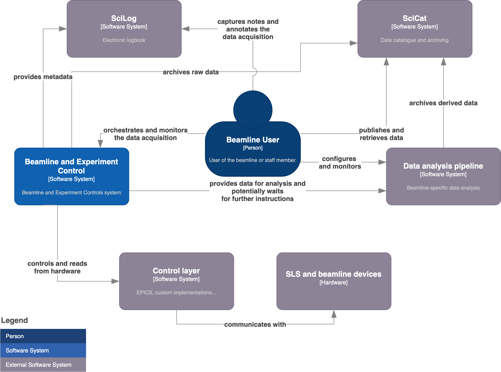

---
hide:
  - navigation
  - toc
---

<section class="bec-home">
  

    

      
Beamline Experiment Control

      <h1>BEC</h1>
      

        A modular platform for data acquisition, device control, and scan orchestration at large research facilities.
      

      

        <a class="md-button md-button--primary" href="getting-started/">Get started</a>
        <a class="md-button" href="developer/getting_started/architecture.html">See architecture</a>
      

      

        

          <strong>Users</strong>
          CLI, GUI, scans, and live data workflows
        

        

          <strong>Operators</strong>
          Service layout, deployment, and configuration
        

        

          <strong>Developers</strong>
          Devices, plugins, scans, and APIs
        

      

    

    

      

        
      

      
Scans

      
Devices

      
Data

    

  

  

    <article>
      01
      <h2>Queue-driven orchestration</h2>
      
Coordinate scans, device actions, and data collection without coupling users to backend services.

    </article>
    <article>
      02
      <h2>Built for beamline workflows</h2>
      
Move from interactive control to automated pipelines with the same shared system model.

    </article>
    <article>
      03
      <h2>Modular by design</h2>
      
Extend the platform through Ophyd devices, scan plugins, UI tooling, and service integrations.

    </article>
  

  <section class="bec-home__section">
    

      
Choose your entry point

      <h2>Start with the part of BEC you need today.</h2>
    

    

      <a class="bec-card" href="user/user.html">
        
User Guide

        <h3>Operate BEC from the CLI and GUI</h3>
        
Install the client, load devices, run scans, and inspect live data and plots.

      </a>

      <a class="bec-card" href="developer/developer.html">
        
Developer Guide

        <h3>Extend devices, scans, and interfaces</h3>
        
Set up a development environment and work across plugins, device layers, and scan logic.

      </a>

      <a class="bec-card" href="developer/getting_started/architecture.html">
        
Architecture

        <h3>Understand how the services fit together</h3>
        
Follow the flow between Redis, scan orchestration, file writing, synchronization, and clients.

      </a>

      <a class="bec-card" href="api_reference/api_reference.html">
        
Reference

        <h3>Browse technical details and API entry points</h3>
        
Use the translated reference pages as a Material-based prototype for deeper system details.

      </a>
    

  </section>

  <section class="bec-home__section bec-home__section--alt">
    

      
Core areas

      <h2>The main parts of the documentation.</h2>
    

    

      <a class="bec-panel" href="developer/devices/devices.html">
        <h3>Devices</h3>
        
Ophyd integration, configuration, simulation, and external data sources.

      </a>
      <a class="bec-panel" href="developer/scans/scans.html">
        <h3>Scans</h3>
        
Scan structure, metadata, stubs, GUI configuration, and plugin tutorials.

      </a>
      <a class="bec-panel" href="developer/data_access/data_access.html">
        <h3>Data access</h3>
        
Messaging, event streams, synchronized readouts, and file-writer behavior.

      </a>
      <a class="bec-panel" href="developer/user_interfaces/user_interfaces.html">
        <h3>User interfaces</h3>
        
Command-line workflows, GUI usage, and client-side extension points.

      </a>
    

  </section>
</section>
