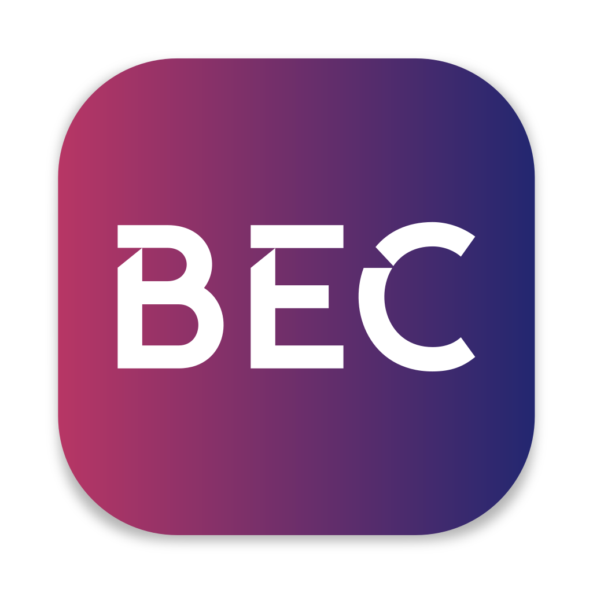

---
hide:
  - navigation
  - toc
  - feedback
---

<section class="bec-home">
  

    

      
Beamline Experiment Control

      <h1>BEC</h1>
      

        A modular platform for data acquisition, device control, and scan orchestration at large research facilities.
      

      

        <a class="md-button md-button--primary" href="getting-started/">Get started</a>
        <a class="md-button" href="learn/system-architecture/overview/index.html">Learn about BEC</a>
      

    

    

      

        
      

      
Orchestrate

      
Connect

      
Visualize

      
Automate

    

  

  

    <article>
      01
      <h2>Orchestrate Experiments</h2>
      
Coordinate scans, queues, devices, and acquisition logic through a shared backend while multiple clients stay in sync.

    </article>
    <article>
      02
      <h2>Connect Devices</h2>
      
Integrate EPICS and non-EPICS hardware behind a common device abstraction.

    </article>
    <article>
      03
      <h2>Visualize Live Data</h2>
      
Follow queues, device state, and scan results from terminal clients, GUIs, and apps.

    </article>
    <article>
      04
      <h2>Automate Workflows</h2>
      
Build repeatable procedures with macros, analysis pipelines, and service integrations.

    </article>
  

</section>
