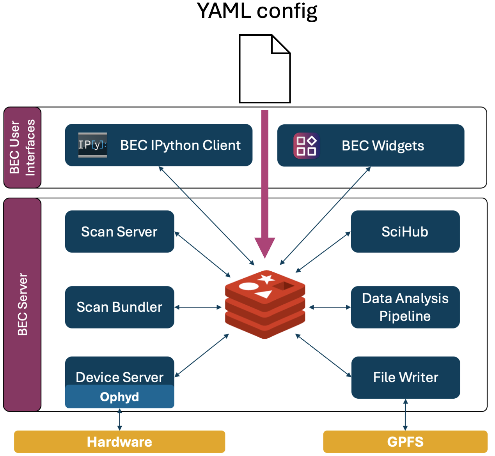
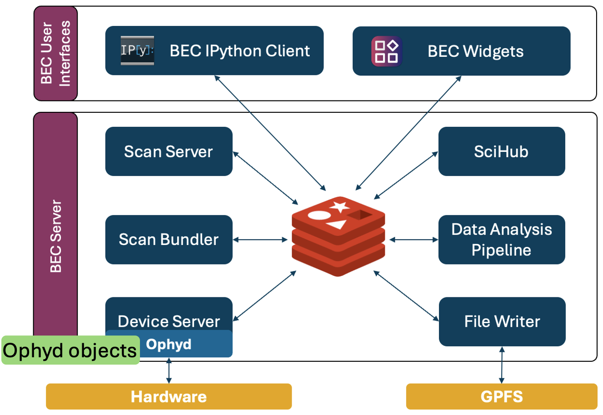
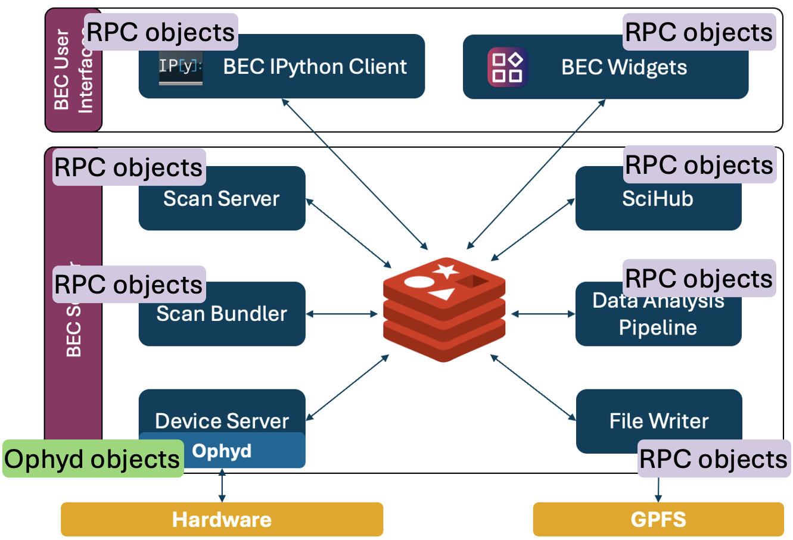

---
related:
  - title: Device Configuration in BEC
    url: learn/devices/device-config-in-bec.md
  - title: Managing YAML Configs
    url: learn/devices/managing-yaml-configs.md
  - title: Load and Save a Device Session
    url: how-to/devices/load-and-save-a-device-session-from-the-bec-ipython-client.md
  - title: Inspect the Current Device Session
    url: how-to/devices/inspect-the-current-device-session-from-the-bec-ipython-client.md
---

# Device Sessions in BEC

The device session is the set of currently active device in BEC. It is the result of loading a list of device configurations, for example from a YAML file, and is shared across all BEC services and clients. This means that any change to the session, whether from loading a new YAML config or from runtime changes in the client, affects all clients and services of that session.

Understanding the concept behind a device session gives you more control about how devices are handled within BEC. It allows you to understand the device interface from perspective of the client, and how runtime changes to device configurations affect your data acquisition with BEC.

## Device configuration, YAML config and device session

It is useful to separate the three terms for clarity:

- The **device configuration** is the description of a device, which is used by BEC's device server to construct the ophyd object, and configure its behavior in BEC.
- The **YAML configuration file** is a list of device configurations that can be loaded into BEC.
- The **device session** is the currently active set of devices loaded in the running BEC session.

A device session usually starts from a list of device configurations, which can be provided by a YAML file. Once loaded, the device session is a shared state across all BEC services and clients. This state may change at runtime, and therefore may differ from the original YAML file on disk. This is an important distinction to keep in mind when working with devices in BEC.

!!! learn "[Learn more about the fields available in a device configuration](device-config-in-bec.md){ data-preview }"

!!! learn "[Learn how multiple config files can be combined into one effective configuration](managing-yaml-configs.md){ data-preview }"

## From configuration files to a device session

When you load a YAML configuration file into BEC, the device server parses the file and tries to create a device session based on the provided device configurations. 
This process includes: 

1. *Initializing ophyd objects* for each device based on the provided device configuration. 
2. *Trying to establish a connection* to the underlying signals of the device. 
3. *Read and publish the device interface* in Redis to make it available to all clients and services.

{align="center" width="80%"}

### 1. Initialize ophyd objects

The device server uses the device configuration to initialize ophyd objects for each device. The `deviceClass` field in the config is used to resolve the ophyd class, and the `deviceConfig` field provides the necessary keyword arguments for initialization. If a device has dependencies on other devices (specified in the `needs` field), BEC first initializes those needed devices before initializing the dependent device. This allows the dependent device to reference the ophyd objects of the needed devices during its own initialization.

{align="center" width="80%"}

!!! warning "Device initialization fails"

    If the ophyd objects fails to initialize, we consider that a critical failure. Therefore, the entire session is flushed and no devices are loaded into the current device session. We recommend to validate YAML files prior to loading them with `ophyd_test` to catch schema and connection issues early. Please refer to [Validate a YAML config file](../../how-to/devices/validate-a-yaml-config-file.md) for more details.

### 2. Try to establish a connection

After the initialization of the ophyd object, BEC attempts to connect to all signals of the device within the configured connection timeout. The default timeout is 5s per device, but it can be adjusted with the `connectionTimeout` field in the device configuration of your YAML file.

!!! warning "Device connection fails"

    If a device fails to connect within the configured timeout, BEC will disable the device in the current session, but continue to load the rest of the devices. You will also be informed about the failed connection when you update your device session. 

### 3. Read and publish the device interface

Once the ophyd objects are initialized and connected, BEC inspects the device interface for each device and publishes the relevant information to Redis. This includes all signals of the device class, as well as methods specified in the class attribute `USER_ACCESS`, which is a list of strings that specifies which methods of the device class should be accessible from the client.
In addition, BEC also publishes the `read()` and `read_configuration()` data for each device during the initial publishing step, so that clients are up-to-date with the latest values for all signals during the initial load of the session. 

### 4. Device Interface from the client perspective

Any BEC client or service is subscribed to the published device information in Redis, and will use this information to construct a proxy representation of the device, which we call the *RPC object*. This RPC object looks and feels like the original ophyd object on the device server, but it is not the same object. When you call methods such as `read()` and `read_configuration()` from the client, it triggers a communication with the device server to execute these methods on the original ophyd object, and then returns the result back to the client. This allows clients to share the same device session and use the same devices without direct access to the original ophyd objects on the device server.

{align="center" width="80%"}

## Why this matters in practice

The architecture of BEC allows for multiple clients and services to share access to the same devices. This requires coordination and control, which is achieved through this concept of a shared device session, and *RPC objects* in the clients. Any client has access to all devices, while the actual device object and connection is handled by the device server. The device server thereby provides a layer of abstraction and control, which allows for a controlled and shared access to devices across multiple clients and services.

## What to learn next

- Continue with [Device Configuration in BEC](../../learn/devices/device-config-in-bec.md) to learn the individual fields in a device entry.
- Continue with [Managing YAML Configs](../../learn/devices/managing-yaml-configs.md) to learn how larger configurations are composed.
