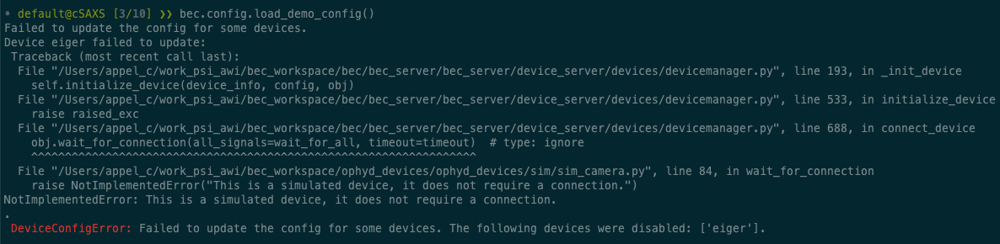
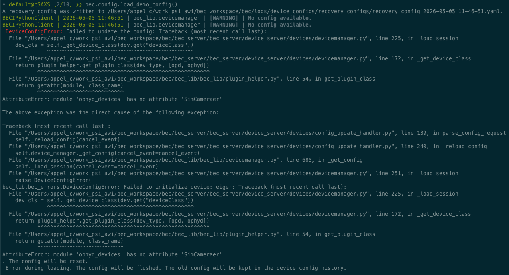
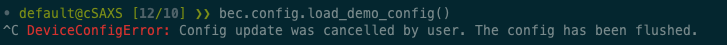

---
related:
  - title: Device Sessions
    url: learn/devices/device-sessions-in-bec.md
  - title: Load and Save a Device Session
    url: how-to/devices/load-and-save-a-device-session-from-the-bec-ipython-client.md
  - title: Validate a YAML configuration file for BEC
    url: how-to/devices/validate-a-yaml-config-file.md
  - title: Device Configuration
    url: learn/devices/device-config-in-bec.md
---

# Error Handling During Session Updates

When updating a device session, BEC will handle errors differently depending on their severity. Some problems affect only one device, while others make the whole session update unreliable and therefore stop the update entirely. There are two possible outcomes:

1. A loaded session, with one or more devices that are disabled
2. A failed session update, where the session is cleared and no devices are loaded

## Two kinds of failures

During a session update, there are two main stages for each device:

1. Creation of the Python object from the device configuration.
2. Connection of that object to the underlying signals.

Failures in the second stage are usually handled per device. Failures in the first stage are treated as critical, because BEC cannot safely continue building the session.

## When a device cannot connect

Sometimes BEC can create the device object, but the device does not connect within the configured timeout. In that case, the session update continues, but that device is marked as disabled.

This means:

- the rest of the devices can still be loaded
- the failing device remains in the session configuration
- the failing device is disabled so that clients and services do not use it as if it were available

{align="center" width="100%"}

!!! tip

    If you have devices that require a long time to connect, consider increasing the `connectionTimeout` field in your [device configuration](../../learn/devices/device-config-in-bec.md) to avoid unnecessary connection failures. The default timeout is 5s per device, but it can be adjusted based on the expected connection time of your devices.

## When the Python object cannot be created

If BEC cannot create a device based on the device configuration, the failure is treated as critical.

Typical reasons include:

- the `deviceClass` cannot be resolved
- required initialization arguments are missing or invalid
- the *init* of the class raises an exception during object creation

In this case, BEC does not keep loading the rest of the session as if nothing happened. Instead, the session update fails because the device server cannot safely build a consistent device session.

{align="center" width="100%"}

## What happens if the device upload is aborted

If the upload of a new session is cancelled by the user (CTRL-C in the terminal) while the device server is building the new session, BEC will stop the upload of the new session at the next possible point, and reset the active session to a clean state. This means that the current session is flushed, and no devices are loaded.

{align="center" width="100%"}

!!! note

    If you cancel the upload while devices are being initialized or connected to, it can take a few seconds for BEC to properly stop. During this time, the terminal may appear unresponsive, but it is important to give BEC the time it needs to safely stop the upload and reset the session.

## Why connection failures are handled differently

BEC can safely represent a device that exists in the session but is disabled. It cannot safely represent a device whose Python object could not be created at all, or a session update that stopped midway in a way that leaves the overall configuration uncertain.

That is why:

- connection failures lead to disabled devices
- object-creation failures lead to an aborted update
- cancelled uploads lead to a reset of the active configuration

## What this means for everyday use

When you load a YAML file, it helps to interpret failures in these two categories:

- If one or more devices are disabled, the session update likely succeeded overall, but some devices could not connect.
- If the session is flushed or reloaded after an error, the update likely failed before BEC could build a safe session.

To reduce the chance of critical failures, validate YAML files before loading them and check device dependencies carefully.

!!! learn "[Learn how to load and save a device session from the BEC IPython client](../../how-to/devices/load-and-save-a-device-session-from-the-bec-ipython-client.md){ data-preview }"

!!! learn "[Learn how to validate a YAML configuration file before loading it](../../how-to/devices/validate-a-yaml-config-file.md){ data-preview }"
