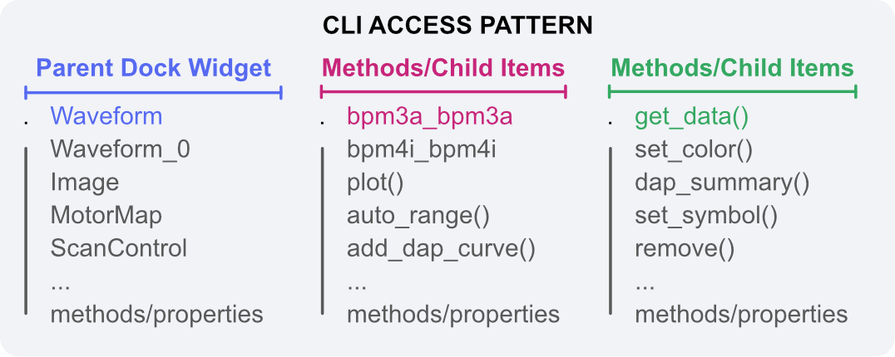

---
related:
  - title: Create Dock Area profiles from the BEC IPython client
    url: getting-started/next-steps/create-dock-area-profiles-from-ipython.md
  - title: GUI RPC interface reference
    url: references/bec-widgets/gui-rpc-interface.md
---

# RPC GUI Control

The BEC IPython client can control GUI widgets through RPC. This lets users create widgets,
configure plots, load profiles, and script GUI behaviour from the command line.

## Main objects

`gui` is the client-side GUI entry point. It exposes windows, available widget classes, and
helpers to create or show GUI elements.

`gui.bec` is the default dock area opened by the `Terminal + Dock` launcher mode. It is a
client-side reference to a `BECDockArea` running in the GUI process.

`gui.available_widgets` lists widget classes that can be created remotely:

```python
gui.bec.new(gui.available_widgets.Waveform)
```

## RPC references

Objects returned by the GUI client are RPC references. A variable such as `wf` does not contain
the Qt widget itself. It contains a reference that sends allowed method calls and property access
to the GUI process.

```python
wf = gui.bec.new(gui.available_widgets.Waveform)
wf.plot(device_x=dev.samx, device_y=dev.bpm4i)
```

The dock area also exposes created widgets through a dynamic namespace. The first Waveform in
`gui.bec` can usually be reached as:

```python
gui.bec.Waveform
```

If a widget is deleted, an existing RPC reference to that widget is no longer useful. Get a new
reference from the dock area namespace, create the widget again, or reload the profile that
contains it.

## CLI access pattern

The command-line namespace follows the GUI widget hierarchy. A parent object, such as `gui.bec`, exposes the widgets
that belong to it. A child widget, such as `gui.bec.Waveform`, exposes its own child items and user-facing methods.



This hierarchy is based on the Qt parent/child object model. In Qt, a `QObject` can have a parent and can be found
through the parent's child tree; see the
[PySide6 QObject documentation](https://doc.qt.io/qtforpython-6/PySide6/QtCore/QObject.html) for the underlying
object-tree behavior.

BEC Widgets uses this Qt hierarchy to decide where an object appears in the CLI:

1. A BEC widget registers itself for RPC when it is exposed to the command-line interface.
2. Its parent is resolved by walking up the Qt parent chain to the nearest RPC-visible BEC widget.
3. The GUI server publishes this registry to the IPython client.
4. The IPython client attaches each child reference below its parent reference.

For example, a Waveform created inside the default Dock Area is available below `gui.bec`:

```python
wf = gui.bec.Waveform
```

Curves or child items created by that Waveform are then available below the Waveform reference when they are exposed
through the same RPC mechanism:

```python
curve = wf.bpm4i_bpm4i
```

The CLI does not show every internal Qt object. It shows BEC Widgets objects that are RPC-visible and have a generated
client-side reference. Internal Qt controls, layout objects, and hidden implementation widgets are intentionally left
out of the command namespace.

## Exposed API surface

Only methods and properties listed in a widget's `USER_ACCESS` are exposed through RPC. This is
intentional: it keeps command-line control focused on stable user-facing operations instead of
internal Qt implementation details.

Examples of exposed operations include:

- `gui.bec.new(...)` to add a widget to a dock area.
- `gui.bec.load_profile(...)` to load a dock area profile.
- `gui.bec.load_profile(..., restore_baseline=True)` to load the baseline version of a profile.
- `gui.bec.restore_baseline_profile(..., show_dialog=False)` for scripted profile restore.
- `wf.plot(...)` and `wf.get_dap_summary()` for Waveform control.

## Timeouts and long operations

RPC calls wait for the GUI process to complete the requested operation. Most calls return
quickly, but profile loading, history access, or data-heavy plotting may take longer. If a call
times out, check whether the GUI process is responsive and whether the operation requested a very
large data set.

For repeatable workflows, prefer loading a saved profile first and then changing only the widget
settings that depend on the current experiment.
