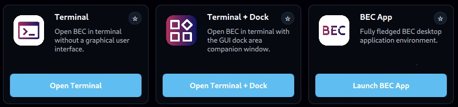
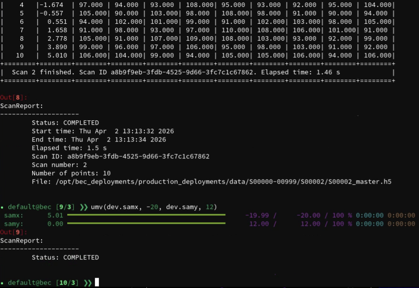
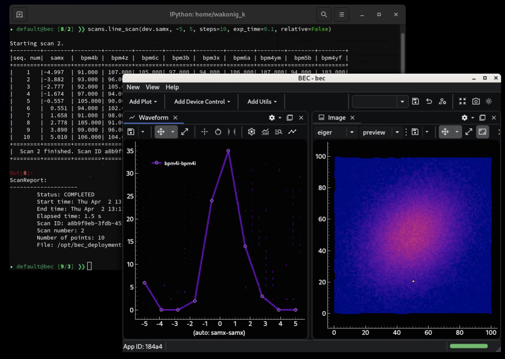
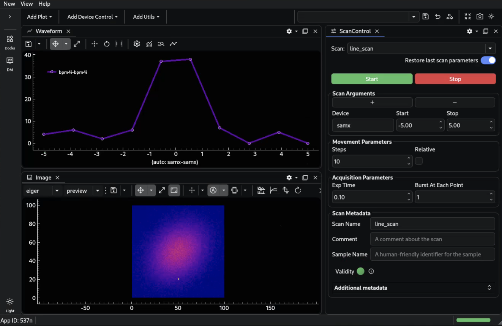

---
related:
  - title: Overview
    url: learn/system-architecture/overview.md
  - title: Core Services
    url: learn/system-architecture/core-services.md
  - title: Data Flow
    url: learn/system-architecture/data-flow.md
---

# Clients

Clients are the main entry points through which users interact with BEC. They connect to the same
backend architecture, but the backend services remain responsible for orchestration, device access,
synchronization, and file writing.

This means that user-facing tools can stay comparatively lightweight, because they do not need to
re-implement the core acquisition logic locally. Because the backend owns the orchestration state,
BEC can also support any number of clients in parallel. Multiple users, tools, or services can
observe and interact with the same running system at the same time.

## Supported Client Modes

BEC currently supports three main client modes:

### Terminal

The terminal client is the most direct way to work with BEC. It is typically centered around the
BEC IPython client and is well suited for interactive beamline control, scripting and macros. It 
usually gives users to most flexibility and direct access to the underlying system, but it may require more familiarity with the command line and Python.

This mode is a good fit when users want:

- direct interactive control
- a scriptable environment
- fast access to devices, scans, and results from the command line

### Terminal + GUI

BEC also supports mixed workflows in which the terminal remains the main control interface while one
or more GUIs are opened alongside it.

This is often the most flexible operating mode. The terminal can be used to launch scans, inspect
state, or run scripts, while graphical tools provide richer views of queues, plots, widgets, or
specialized beamline interfaces.

The GUI is always launched as a separate process, so it can be closed and reopened without affecting the terminal session. Moreover, if for some reason the GUI process crashes or becomes unresponsive, the terminal client remains unaffected and can be used to restart the GUI or continue working without it. This separation also allows users to choose different GUI tools or versions without impacting their terminal workflow.

### BEC App

The BEC App provides a more fully graphical entry point into the system. In this mode, users can
work primarily through application windows and widgets rather than through the terminal.

This is useful when users want:

- a more guided graphical workflow
- shared beamline-specific widgets
- interfaces that are easier to operate without command-line interaction

## Shared Client Model

All of these client modes connect to the same backend architecture. In practice, a client sends
requests, observes queue and scan status, displays progress and data, and may expose higher-level
helper APIs such as `bec.history`.

Because they all share the same backend model, users can switch between these modes without changing
the underlying orchestration logic. This is also why several clients can run in parallel against the
same system.

## Event-Driven Interaction

This event-based architecture fits graphical user interfaces naturally. GUIs are themselves
event-driven systems: they subscribe to state changes, react to user actions, and update views
asynchronously. In BEC, a GUI can listen to queue events, progress updates, device readouts, and
file notifications directly from the shared event streams, without needing its own orchestration
backend.

!!! info "What to remember"
    - BEC currently supports three main client modes: Terminal, Terminal + GUI, and BEC App.
    - All client modes connect to the same backend services.
    - The backend remains the source of truth for orchestration and hardware access.
    - Multiple clients can run in parallel against the same system.
    - GUIs fit naturally into this model because they are event-driven themselves.
