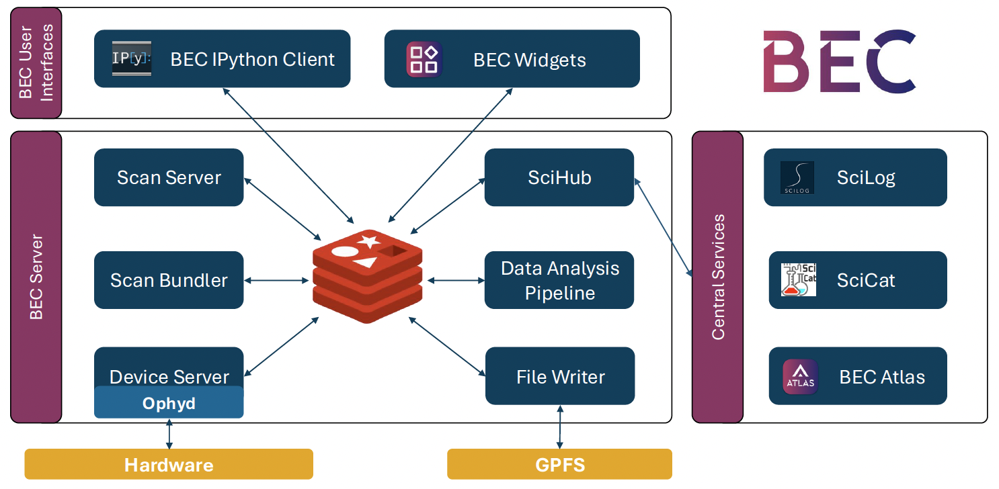

# Data Flow

BEC is built around shared event streams and coordinated service interactions. Requests, state
updates, readouts, metadata, and file-writing signals move through the system in a way that lets
multiple clients and services observe the same acquisition without duplicating the orchestration
logic.

## How Data Flows Through the System

The exact message details depend on the scan type, but the overall lifecycle is:

1. **Client**: A client (GUI or terminal) submits a scan request.
2. **Scan Server**: The scan server validates the request and assembles scan instructions.
3. **Scan Server**:The scan is inserted into a queue and picked up by a scan worker.
4. **Scan Worker**: The scan worker issues device operations through Redis.
5. **Device Server**:The device server performs the corresponding actions on ophyd devices.
6. **Device Server**:Devices and services publish status, progress, metadata, and readouts back to Redis.
7. **Scan Bundler**:The scan bundler synchronizes asynchronous readouts into logical scan points.
8. **Client, File Writer, SciHub, Data Analysis Pipelines**: Clients, file writers, and analysis services consume those streams.
9. **File Writer**: The file writer persists the scan to disk, while clients can still inspect recent results live or
   through history helpers.

!!! info "What to remember"
    - Data in BEC flows through shared event streams rather than direct client-to-client control
      paths.
    - A scan request moves from the client to the scan server, then through device execution and
      synchronized readout handling.
    - The same live streams can be consumed in parallel by clients, the file writer, SciHub, and
      analysis services.
    - Clients can stay lightweight because orchestration and synchronization remain on the backend.
