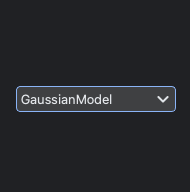

DapComboBox lists available DAP models and can emit a DAP configuration when x-axis, y-axis, and model are selected. Most users interact with DAP through Waveform, but this widget is useful in custom GUI compositions.

