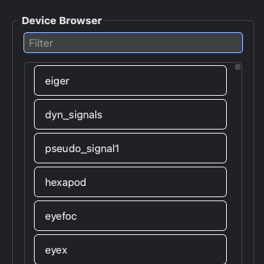

DeviceBrowser shows the devices available in the current BEC session. Use it to inspect configured devices and browse their metadata from the GUI.

The useful interactions are GUI-based; from the BEC IPython client, create it in the Dock Area and then interact with the displayed device list.
