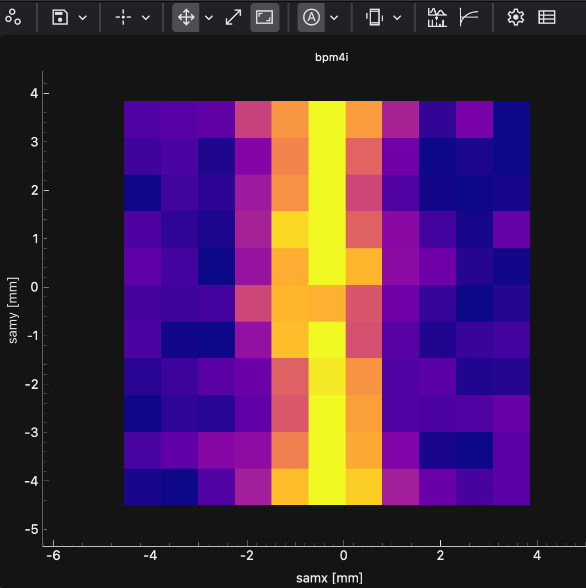

Heatmap displays 2D scan data using a color-mapped image. It is the right choice for grid scans and for step scans that should be interpolated onto a 2D surface.

Common uses:

- plot `x`, `y`, and detector intensity from grid scans
- interpolate irregular step-scan points
- tune oversampling, interpolation, and color maps
