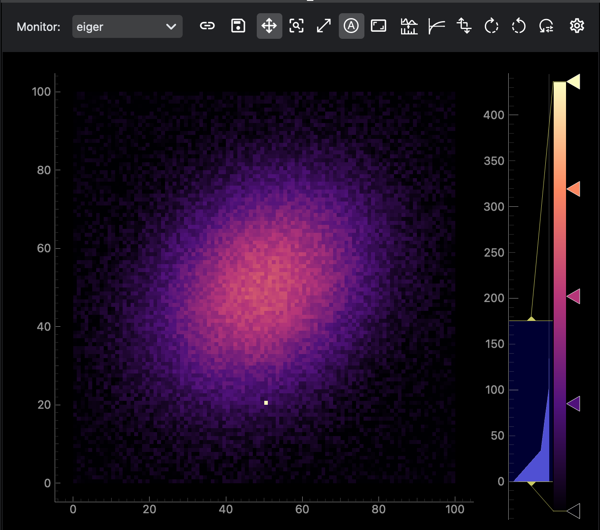

Image displays 2D data from detector signals. Use it for cameras, area detectors, and other image-like data streams that should be inspected as an image rather than as a curve.

Common uses:

- display live 2D detector output
- adjust color map and color range
- apply log or FFT display transformations
- create image ROIs for inspection
