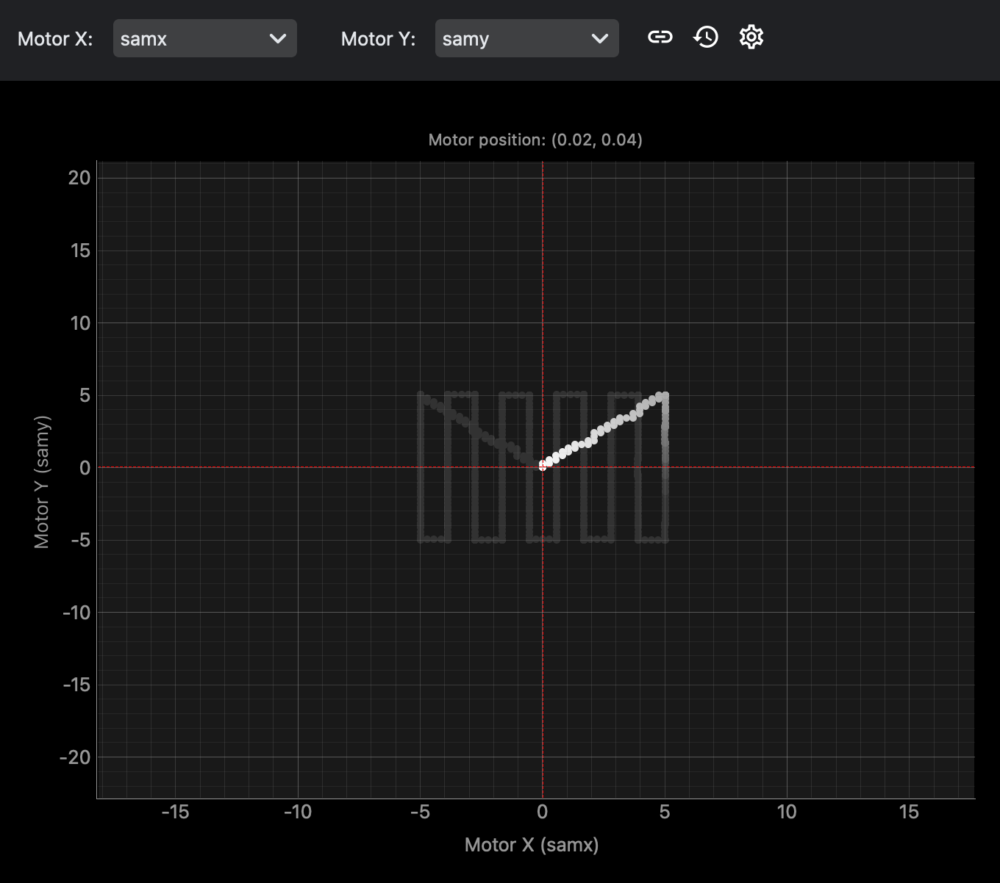

MotorMap visualizes the current and recent positions of two positioners. Use it to keep spatial context while moving motors or running 2D scans.

Common uses:

- follow `samx` and `samy` positions
- keep a bounded history of recent points
- inspect the latest motor-map data from Python
