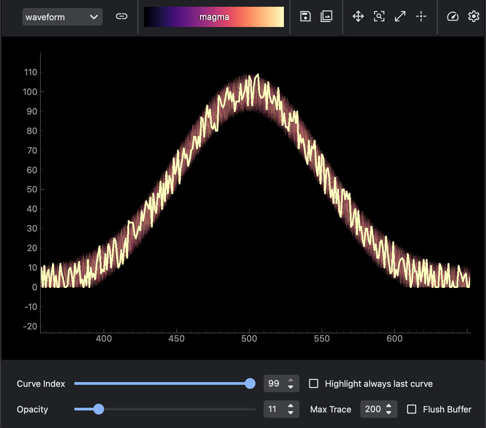

MultiWaveform displays many waveform traces from the same monitor signal. Use it when each update produces a full 1D trace and you want to compare recent traces in one plot.

Common uses:

- monitor repeated 1D detector traces
- keep the latest trace highlighted
- limit how many traces remain visible
