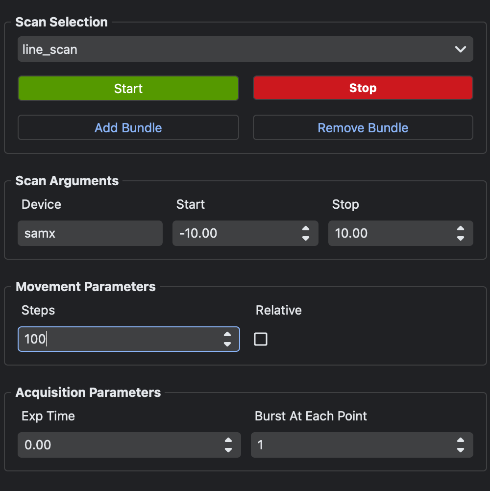

ScanControl provides a GUI for choosing scan types, editing scan arguments, and submitting scans to BEC. Use it when you want scan submission controls inside the Dock Area.

The widget is primarily operated through the GUI. From the BEC IPython client, the stable operation is to create it and optionally control dock attachment.
