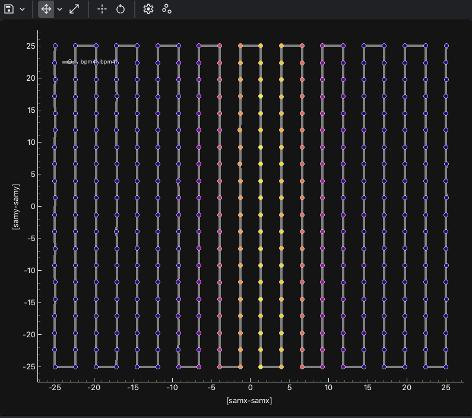

ScatterWaveform plots points from two position-like signals and colors them by a third signal. Use it when the scan path is not naturally represented as a rectangular image or when you want to inspect point-by-point sampling.

Common uses:

- visualize non-grid 2D scan paths
- inspect detector intensity along arbitrary scan trajectories
- compare with Heatmap interpolation for the same data
