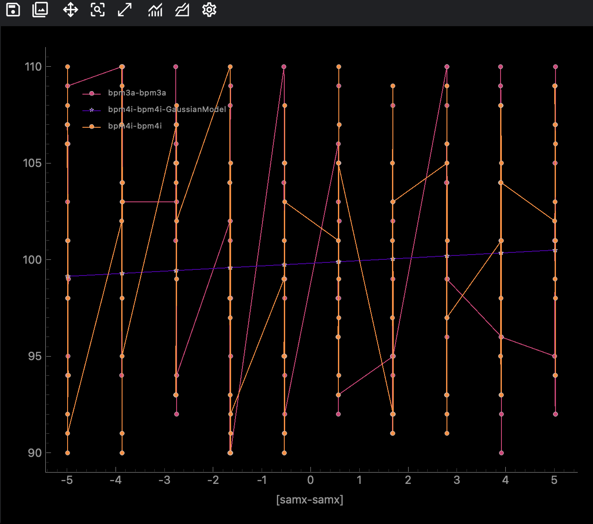

Waveform is the main 1D plotting widget. Use it for live device signals, completed scan history, custom arrays, and DAP-assisted curve fitting. It is the widget most users start with when they want to inspect detector intensity versus a motor position.

Common uses:

- plot a monitored device signal during a scan
- compare scan history with new measurements
- add fitted DAP curves such as `GaussianModel`
- read plotted data back into Python with `get_all_data()`
